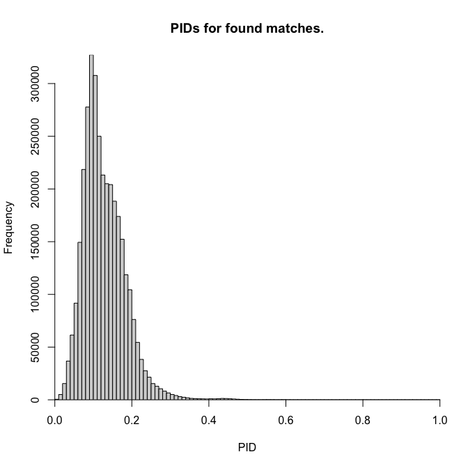
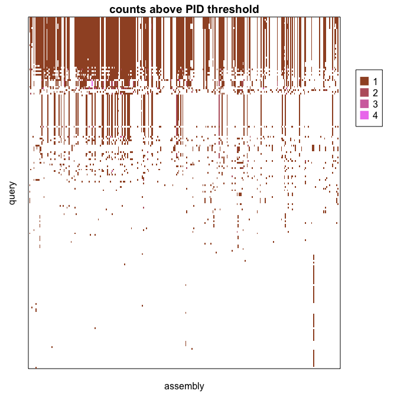

BLAST-like searches with DECIPHER
================
Nicholas P. Cooley, Department of Biomedical Informatics, University of
Pittsburgh
2025-01-21

# A simple workflow

!Currently under construction!

This workflow example was inspired by a request for help from some more
wet-lab oriented colleagues who needed assistance doing some data
analysis. They were interested in performing what would seem to a
well-entrenched computational biologist or bioinformatician as a
standard BLAST-appropriate task. With the introduction of the functions
`SearchIndex` and `AlignPairs` to `DECIPHER`, it is now possible to
perform sequence similarity searches in R without external dependencies.
So helping these colleagues achieve their goal seemed like a good place
to double dip and showcase these new functionalities.

There are plenty of reasons to chose alternative search strategies in
bioinformatics, and this tutorial isn’t making any value judgements
about strategies generally.

The data accessed here isn’t the exact data that my colleagues used, but
it’s similar enough. For this somewhat contrived example we’re searching
the proteomes for all reference archaea that have complete genomes with
the training data used for the NCBI’s AMRFinder tool. This task isn’t
too dissimilar from one that many folks may be interested in, or from
how AMRFinder itself works. However the code present in this example is
fairly unsophisticated, please keep in mind that it is a simple example
meant to be accessible.

## Setting your environment

This document is knit together from a single Rmd file and contains code
relevant to the general task and some simple plots. In this first chunk
we’re just performing a few simple tasks. The first is collecting the
start of the script for timing purposes, the second is loading in the
packages we’ll be using, and the last is just a few gymnastics to ensure
that the external dependency we’re using to collect our data exists and
R has access to it. We’re using the `edirect` tools to collect data here
because it allows us to collect data smoothly from the NCBI, and then
discard it afterwards while leaving a trail of *what* data we collected,
and not requiring us to store or maintain a mirror of said data.

``` r
timestart <- Sys.time()
# we're only loading in one package here, because it will load in all its dependencies
suppressMessages(library(DECIPHER))
suppressMessages(library(htmltools))

# the only other thing we're relying on is the NCBI's edirect tools, which need to be accessible in our path...
# show the location of one of edirect's tools:
system(command = "which esearch",
       intern = TRUE)
```

    ## [1] "/Users/nicholascooley/edirect/esearch"

``` r
# let's ask whether it's in the path, remember, we're asking for the directory, not the tool itself
place_holder <- Sys.getenv("PATH")
place_holder <- strsplit(x = place_holder,
                         split = ":",
                         fixed = TRUE)[[1]]
# return true if the directory is in the path
any(grepl(pattern = gsub(pattern = "/[^/]*$",
                         replacement = "",
                         x = system(command = "which esearch",
                                    intern = TRUE)),
          x = place_holder))
```

    ## [1] TRUE

## Getting your data

In this second chunk we’re starting by defining a list that contains all
the user defined variables we think we’ll need as the script progresses.
This serves a few purposes, the first being that we can access large
variables relatively easily and reliably, the second is just to improve
legibility and ensure that the nobs we can or should be able to turn are
up front in the script. We then pull our data down from the NCBI FTP
site, some spinach is present in this process to improve legibility. A
small commented out section of code near the bottom of this chunk was
used to remove sequences with non-canonical or ambiguous amino acids, as
a previous version of `AlignPairs` didn’t handle these correctly. That
has been addressed, but the code is left as an example of how one might
perform QA/QC in a similar manner.

If this repo is being used a template, it is likely that this chunk is
where most of your relevant changes to code will take place as your data
in particular will likely be specific to your needs or interests.

``` r
# lets define all of our args up front, this isn't necesary, but can make our code more legible
# and simpler to change in the long run

ARGS <- list("query" = "https://ftp.ncbi.nlm.nih.gov/pathogen/Antimicrobial_resistance/AMRFinderPlus/database/latest/AMRProt.fa",
             "subject" = "archaea",
             "K" = 5, # 4 is more time consuming, but gives more exhaustive hits, 6 is faster but potentially misses results, 5 is a happy median, and should give results that are roughly equivalent to blast
             "processors" = NULL,
             "verbose" = TRUE,
             "PID_Threshold" = 0.4, # somewhat arbitrary, this example is a little contrived, so almost any hit above random is a little unexpected/interesting/illustrative
             "Save" = c("t02",
                        "totaltime",
                        # "seqs", # this is commented out because we don't need to keep this around for a toy example
                        "query",
                        "edirect_result"),
             "key" = "value")

# construct our edirect query
edirect_query <- paste0("esearch -db assembly ",
                        "-query '",
                        ARGS$subject,
                        "[organism] ", # target organism can be changed here
                        'AND "complete genome"[filter] ', # only complete genomes
                        'AND "refseq has annotation"[properties] ', # only genomes with annotations
                        'AND "latest refseq"[filter] ', # only latest
                        'AND "taxonomy check ok"[filter] ', # passes tax check
                        'AND "reference genome"[filter] ',
                        "NOT anomalous[filter]' ",
                        '| ',
                        'esummary ',
                        '| ',
                        'xtract -pattern DocumentSummary -element FtpPath_RefSeq')

# run the query
edirect_result <- system(command = edirect_query,
                         intern = TRUE,
                         timeout = 600)

# grab our subject seqs from the ftp site
seqs <- vector(mode = "list",
               length = length(edirect_result))
# send messages from download.file to a /dev/null
# see https://stackoverflow.com/questions/66138345/how-to-suppress-download-file-trying-url-message-in-r
# especially for the warnings in ?sink
nullcon <- file(nullfile(), open = "wb")
sink(nullcon, type = "message")
for (m1 in seq_along(seqs)) {
  seqs[[m1]] <- try(readAAStringSet(paste0(edirect_result[m1],
                                           "/",
                                           strsplit(x = edirect_result[m1],
                                                    split = "/",
                                                    fixed  = TRUE)[[1]][10],
                                           "_protein.faa.gz")))
  if (is(object = seqs[[m1]],
         class2 = "AAStringSet")) {
    names(seqs[[m1]]) <- paste(strsplit(x = edirect_result[m1],
                                        split = "/",
                                        fixed  = TRUE)[[1]][10],
                               names(seqs[[m1]]))
  }
  
}
# undue the null sink
# and nuke the connection
sink(type = "message")
close(nullcon)
# subset to successfully collected seqs
w1 <- vapply(X = seqs,
             FUN = function(x) {
               is(object = x,
                  class2 = "AAStringSet")
             },
             FUN.VALUE = vector(mode = "logical",
                                length = 1))
seqs <- do.call(c,
                seqs[w1])
edirect_result <- edirect_result[w1]

# remove sequences with ambiguity codes or non-canonical AAs
# w1 <- alphabetFrequency(seqs)
# w1 <- apply(X = w1,
#             MARGIN = 1,
#             FUN = function(x) {
#               any(x[21:30] > 0)
#             })
# seqs <- seqs[!w1]

query <- readAAStringSet(filepath = ARGS$query)
```

## Running your search to create an initial result

Once our data is set up, the search routine is similar to BLAST style
searches. You can read about the relevant functions in their man pages,
`?IndexSeqs`, `?SearchIndex`, and `?AlignPairs`. Our first step is to
build a database to search against, and then we just search against it
with our query. We append a slight bit of extra code in between
searching and aligning to enforce global alignments, but otherwise there
isn’t much fancy spinach to add on our own here.

We end this code chunk with a slight condensation of `AlignPairs`’
default results while appending a global PID and a global score to the
results.

``` r
i01 <- IndexSeqs(subject = seqs,
                 K = ARGS$K,
                 processors = ARGS$processors,
                 verbose = ARGS$verbose)
```

    ## ================================================================================
    ## 
    ## Time difference of 57.73 secs

``` r
s01 <- SearchIndex(pattern = query,
                   invertedIndex = i01,
                   subject = seqs,
                   processors = ARGS$processors,
                   verbose = ARGS$verbose)
```

    ## ================================================================================
    ## 
    ## Time difference of 1712.4 secs

``` r
# add anchors to force global alignments, hard coded values here shouldn't change
# so we can just stick them here
s01$Position <- mapply(SIMPLIFY = FALSE,
                       FUN = function(x, y, z) {
                         cbind(matrix(data = 0L,
                                      nrow = 4L),
                               x,
                               matrix(data = c(y, y, z, z),
                                      nrow = 4L))
                       },
                       x = s01$Position,
                       y = width(query)[s01$Pattern] + 1L,
                       z = width(seqs)[s01$Subject] + 1L)
p01 <- AlignPairs(pattern = query,
                  subject = seqs,
                  pairs = s01,
                  processors = ARGS$processors,
                  verbose = ARGS$verbose)
```

    ## ================================================================================
    ## 
    ## Time difference of 323.43 secs

``` r
# normalize score, and grab global PIDs
p02 <- cbind(p01[, 1:9],
             "sco1" = p01$Score / p01$AlignmentLength,
             "sco2" = p01$Matches / p01$AlignmentLength)
```

## Some plots

A histogram of the global alignments for hits that we found. Given that
this is a toy example, and the nature of our query and database, we’re
not expecting considerably close hits. Though we do find global
alignments with measures that imply considerable shared sequence.

``` r
hist(x = p02$sco2,
     breaks = seq(from = 0,
                  to = 1,
                  by = 0.01),
     xaxs = "i",
     yaxs = "i",
     main = "PIDs for found matches.",
     xlab = "PID")
```



We can present hits above a given threshold in a heatmap like plot
against genome of origin to give a rough idea of where, and in what
quantities and patterns we’re finding hits. If this information is
expanded with some kind of core alignment or phylogeny, these presence
absence patterns can be plotted against a tree for phylogeny aware
analysis.

``` r
# hits within a selected limit
t01 <- tapply(X = p02,
              INDEX = p02$Pattern,
              FUN = function(x) {
                x[x$sco2 >= ARGS$PID_Threshold, ]
              },
              simplify = FALSE)

# build a key for sanity's sake
seq_key <- do.call(rbind,
                   lapply(X = strsplit(x = names(seqs),
                                       split = " ",
                                       fixed = TRUE),
                          FUN = function(x) {
                            x[1:2]
                          }))
seq_key <- data.frame("assembly" = seq_key[, 1],
                      "prot_accession" = seq_key[, 2])
u_assemblies <- unique(seq_key$assembly)

# the rownames of seq_key should now related to p02$Subject
# and we can build a presence absence table of hits in our search to our assemblies
hit_key <- lapply(X = t01,
                  FUN = function(x) {
                    table(factor(seq_key$assembly[x$Subject],
                                 levels = u_assemblies))
                  })
hit_key <- do.call(rbind,
                   hit_key)
present_keys <- hit_key[rowSums(hit_key) > 0, ]

# create an ordering vector based off the number of isolates that had
# at least one hit for the row
# order is ascending by default
o1 <- order(apply(X = present_keys,
                  MARGIN = 1,
                  FUN = function(x) {
                    sum(x > 0)
                  }))

colvec01 <- colorRampPalette(colors = c("sienna", "violet"))(max(present_keys))
par(mar = c(2.5, 2.5, 1.5, 5),
    mgp = c(1, .5, 0))
plot(x = 0,
     y = 0,
     xlim = c(0, ncol(present_keys)),
     ylim = c(0, nrow(present_keys)),
     type = "n",
     xlab = "assembly",
     ylab = "query",
     main = "counts above PID threshold",
     xaxs = "i",
     yaxs = "i",
     xaxt = "n",
     yaxt = "n",
     frame.plot = TRUE)
for (m1 in seq_along(o1)) {
  w1 <- which(present_keys[o1[m1], ] > 0)
  if (length(w1) > 0) {
    rect(xleft = w1 - 1L,
         xright = w1,
         ytop = rep(m1, length(w1)),
         ybottom = rep(m1 - 1, length(w1)),
         col = colvec01[present_keys[o1[m1], w1]],
         border = NA)
  }
}
legend(x = ncol(present_keys) + (ncol(present_keys) * 0.05),
       y = nrow(present_keys) * 0.85,
       legend = seq(max(present_keys)),
       col = colvec01,
       pch = 15,
       pt.cex = 2,
       xpd = TRUE)
```



Both `Biostrings` and `DECIPHER` have nice tools for sequence
visualization following analysis, however making plots with, or
displaying alignments isn’t always the simplest or most informative
task. One option shown here is using html to display your alignment in a
tidy way for viewing in a web browser. The github engine doesn’t exactly
display html as intended, but the generated alignment is included for
viewing separately.

``` r
# get some rough descriptions of groups captured by our queries
# mean alignment of query to subject
ph1 <- vapply(X = t01,
              FUN = function(x) {
                mean(x$sco2)
              },
              FUN.VALUE = vector(mode = "numeric",
                                 length = 1L))
# total number of found subjects
ph2 <- vapply(X = t01,
              FUN = function(x) {
                nrow(x)
              },
              FUN.VALUE = vector(mode = "integer",
                                 length = 1L))

# just grab the first group with a mean PID great than .5 and 10 or more found subjects
w1 <- unname(which(ph1 >= 0.5 & ph2 >= 10))
w2 <- c(query[w1[1]],
        seqs[t01[[w1[1]]]$Subject])

# align them
# turn verbose off because this prints out a bunch of progress bars
w3 <- AlignSeqs(w2, verbose = FALSE)

# if there are a whole bunch lets just look at 10 random ones
if (length(w3) > 10) {
  set.seed(1986)
  w3 <- w3[c(1,
             sample(x = 2:length(w3),
                    size = 9,
                    replace = FALSE))]
}

# create a placeholder temporary file
tmp01 <- "alignment.html"
file.create(tmp01)
```

    ## [1] TRUE

``` r
# toss the alignment view into it
BrowseSeqs(myXStringSet = w3,
           htmlFile = tmp01,
           openURL = FALSE)

# read it into R
htmllines <- readLines(tmp01)
# we need to drop some of the style things because github md doesn't white list them
for (m1 in 5:length(htmllines)) {
  htmllines[m1] <- paste0(htmllines[m1], '<br>')
}
# display it with the knitr engine
# this document is being displayed through the github md engine so it has a few quirks
# when it comes to displaying html, see:
# https://stackoverflow.com/questions/14951321/how-to-display-html-content-in-github-readme-md
# the alignment with all it's intended coloring and formatting can be viewed separately in its html file:
# alignment.html
HTML(htmllines)
```

<html><head><meta http-equiv="Content-Type" content="text/html; charset=utf-8"><title>  </title></head> <style type=text/css> span._1 {background:#CC007A; color:#FFF;} span._2 {background:#CC005A; color:#FFF;} span._3 {background:#CC0039; color:#FFF;} span._4 {background:#CC0018; color:#FFF;} span._5 {background:#CC0800; color:#FFF;} span._6 {background:#CC2900; color:#FFF;} span._7 {background:#CC4900; color:#FFF;} span._8 {background:#CC6A00; color:#FFF;} span._9 {background:#CC8B00; color:#FFF;} span._10 {background:#CCAB00; color:#FFF;} span._11 {background:#CCCC00; color:#FFF;} span._12 {background:#ABCC00; color:#FFF;} span._13 {background:#8BCC00; color:#FFF;} span._14 {background:#6ACC00; color:#FFF;} span._15 {background:#49CC00; color:#FFF;} span._16 {background:#29CC00; color:#FFF;} span._17 {background:#08CC00; color:#FFF;} span._18 {background:#00CC18; color:#FFF;} span._19 {background:#00CC39; color:#FFF;} span._20 {background:#00CC5A; color:#FFF;} span._21 {background:#00CC7A; color:#FFF;} span._22 {background:#00CC9B; color:#FFF;} span._23 {background:#00CCBC; color:#FFF;} span._24 {background:#00BCCC; color:#FFF;} span._25 {background:#009BCC; color:#FFF;} span._26 {background:#007ACC; color:#FFF;} span._27 {background:#005ACC; color:#FFF;} span._28 {background:#0039CC; color:#FFF;} span._29 {background:#0018CC; color:#FFF;} span._30 {background:#0800CC; color:#FFF;} span._31 {background:#2900CC; color:#FFF;} </style> <br> <pre><br>                                                                                                                                              20                  40                  60                  80                 100                 120                 140                 160                 180                 200                 220                 240                 260                 280                 300                 320                 340                 360                 380                 400                 420                 440                 460                 480                 500        <br>                                                                                                                            '''''''''|'''''''''|'''''''''|'''''''''|'''''''''|'''''''''|'''''''''|'''''''''|'''''''''|'''''''''|'''''''''|'''''''''|'''''''''|'''''''''|'''''''''|'''''''''|'''''''''|'''''''''|'''''''''|'''''''''|'''''''''|'''''''''|'''''''''|'''''''''|'''''''''|'''''''''|'''''''''|'''''''''|'''''''''|'''''''''|'''''''''|'''''''''|'''''''''|'''''''''|'''''''''|'''''''''|'''''''''|'''''''''|'''''''''|'''''''''|'''''''''|'''''''''|'''''''''|'''''''''|'''''''''|'''''''''|'''''''''|'''''''''|'''''''''|'''''''''|'''''        <br>       1753231480|KAA9473339.1|1|1|arsB_Lm|arsB_Lm||1|ARSENITE|ARSENIC|arsenite_efflux_transporter_membrane_subunit_ArsB    <span class="_1"><span class="_29">--</span></span><span class="_14">M</span><span class="_17">S</span><span class="_2">A</span><span class="_8">E</span><span class="_4">N</span><span class="_1"><span class="_29">-------------------------------------------------------------</span></span><span class="_13">KK</span><span class="_7">Q</span><span class="_9">G</span><span class="_12">L</span><span class="_9">G</span><span class="_11">I</span><span class="_15">F</span><span class="_8">E</span><span class="_13">K</span><span class="_20">Y</span><span class="_12">L</span><span class="_18">T</span><span class="_12">L</span><span class="_19">W</span><span class="_21">V</span><span class="_11">I</span><span class="_12">L</span><span class="_6">C</span><span class="_14">M</span><span class="_2">A</span><span class="_21">V</span><span class="_9">G</span><span class="_21">V</span><span class="_12">L</span><span class="_11">I</span><span class="_9">G</span><span class="_13">K</span><span class="_15">F</span><span class="_11">I</span><span class="_16">P</span><span class="_2">A</span><span class="_21">V</span><span class="_2">A</span><span class="_5">D</span><span class="_18">T</span><span class="_12">L</span><span class="_17">S</span><span class="_13">K</span><span class="_15">F</span><span class="_8">E</span><span class="_20">YY</span><span class="_7">Q</span><span class="_1"><span class="_29">-----</span></span><span class="_21">V</span><span class="_17">S</span><span class="_11">I</span><span class="_16">P</span><span class="_18">T</span><span class="_2">A</span><span class="_11">I</span><span class="_12">L</span><span class="_11">I</span><span class="_19">W</span><span class="_12">L</span><span class="_14">M</span><span class="_11">I</span><span class="_20">Y</span><span class="_16">P</span><span class="_14">MM</span><span class="_12">L</span><span class="_13">K</span><span class="_11">I</span><span class="_5">D</span><span class="_15">F</span><span class="_18">T</span><span class="_17">S</span><span class="_11">I</span><span class="_2">A</span><span class="_3">R</span><span class="_2">AA</span><span class="_13">K</span><span class="_1"><span class="_29">--</span></span><span class="_13">K</span><span class="_16">P</span><span class="_13">K</span><span class="_9">G</span><span class="_12">L</span><span class="_11">II</span><span class="_18">T</span><span class="_6">C</span><span class="_21">V</span><span class="_18">T</span><span class="_4">N</span><span class="_19">W</span><span class="_12">L</span><span class="_11">I</span><span class="_13">K</span><span class="_16">P</span><span class="_15">F</span><span class="_18">T</span><span class="_14">M</span><span class="_20">Y</span><span class="_2">A</span><span class="_11">I</span><span class="_17">S</span><span class="_2">A</span><span class="_15">FFF</span><span class="_20">Y</span><span class="_21">VV</span><span class="_15">F</span><span class="_13">K</span><span class="_1"><span class="_29">------------------------------------</span></span><span class="_4">N</span><span class="_12">L</span><span class="_11">I</span><span class="_16">P</span><span class="_21">V</span><span class="_5">D</span><span class="_12">L</span><span class="_2">A</span><span class="_13">K</span><span class="_8">E</span><span class="_20">Y</span><span class="_21">V</span><span class="_2">A</span><span class="_9">G</span><span class="_2">A</span><span class="_21">V</span><span class="_11">I</span><span class="_12">L</span><span class="_9">G</span><span class="_2">AA</span><span class="_16">P</span><span class="_6">C</span><span class="_18">T</span><span class="_2">A</span><span class="_14">M</span><span class="_21">V</span><span class="_15">F</span><span class="_21">V</span><span class="_19">W</span><span class="_17">S</span><span class="_20">Y</span><span class="_12">L</span><span class="_18">T</span><span class="_13">K</span><span class="_9">G</span><span class="_5">D</span><span class="_2">A</span><span class="_9">G</span><span class="_20">Y</span><span class="_18">T</span><span class="_12">L</span><span class="_21">V</span><span class="_7">Q</span><span class="_21">V</span><span class="_2">A</span><span class="_11">I</span><span class="_4">N</span><span class="_5">D</span><span class="_12">L</span><span class="_11">II</span><span class="_12">L</span><span class="_15">F</span><span class="_12">L</span><span class="_15">F</span><span class="_2">A</span><span class="_16">P</span><span class="_11">I</span><span class="_21">V</span><span class="_2">A</span><span class="_15">F</span><span class="_12">LL</span><span class="_9">G</span><span class="_21">V</span><span class="_1"><span class="_29">-</span></span><span class="_5">D</span><span class="_4">N</span><span class="_21">V</span><span class="_2">A</span><span class="_21">V</span><span class="_16">P</span><span class="_14">M</span><span class="_9">G</span><span class="_18">T</span><span class="_12">LLL</span><span class="_17">S</span><span class="_18">T</span><span class="_12">LL</span><span class="_15">F</span><span class="_21">VVV</span><span class="_16">P</span><span class="_12">LLL</span><span class="_9">G</span><span class="_15">FF</span><span class="_18">T</span><span class="_3">R</span><span class="_21">V</span><span class="_11">III</span><span class="_13">K</span><span class="_4">N</span><span class="_13">K</span><span class="_9">G</span><span class="_12">L</span><span class="_2">A</span><span class="_20">Y</span><span class="_15">F</span><span class="_8">E</span><span class="_4">N</span><span class="_21">V</span><span class="_15">F</span><span class="_12">L</span><span class="_13">KK</span><span class="_15">F</span><span class="_4">N</span><span class="_17">S</span><span class="_21">V</span><span class="_18">T</span><span class="_11">I</span><span class="_14">M</span><span class="_9">G</span><span class="_12">LLL</span><span class="_18">T</span><span class="_12">L</span><span class="_11">III</span><span class="_15">F</span><span class="_17">S</span><span class="_15">F</span><span class="_7">Q</span><span class="_9">G</span><span class="_8">E</span><span class="_13">K</span><span class="_11">I</span><span class="_12">L</span><span class="_2">A</span><span class="_4">N</span><span class="_16">P</span><span class="_14">M</span><span class="_10">H</span><span class="_11">I</span><span class="_12">LL</span><span class="_11">I</span><span class="_2">A</span><span class="_11">I</span><span class="_16">P</span><span class="_12">L</span><span class="_11">II</span><span class="_7">Q</span><span class="_18">T</span><span class="_15">F</span><span class="_12">L</span><span class="_11">I</span><span class="_15">F</span><span class="_18">T</span><span class="_11">I</span><span class="_2">A</span><span class="_20">Y</span><span class="_1"><span class="_29">-</span></span><span class="_9">G</span><span class="_19">W</span><span class="_2">A</span><span class="_13">K</span><span class="_12">L</span><span class="_19">W</span><span class="_13">K</span><span class="_12">L</span><span class="_16">P</span><span class="_10">H</span><span class="_5">D</span><span class="_11">I</span><span class="_2">A</span><span class="_17">S</span><span class="_16">P</span><span class="_2">A</span><span class="_9">G</span><span class="_14">M</span><span class="_11">I</span><span class="_9">G</span><span class="_2">A</span><span class="_17">S</span><span class="_4">N</span><span class="_15">FF</span><span class="_8">E</span><span class="_12">L</span><span class="_2">A</span><span class="_21">V</span><span class="_2">A</span><span class="_21">V</span><span class="_2">A</span><span class="_11">I</span><span class="_17">S</span><span class="_12">L</span><span class="_15">F</span><span class="_9">G</span><span class="_12">L</span><span class="_7">Q</span><span class="_17">S</span><span class="_9">G</span><span class="_2">A</span><span class="_18">T</span><span class="_12">L</span><span class="_2">A</span><span class="_18">T</span><span class="_21">VV</span><span class="_9">G</span><span class="_21">V</span><span class="_12">L</span><span class="_21">V</span><span class="_8">E</span><span class="_21">V</span><span class="_16">P</span><span class="_21">V</span><span class="_14">M</span><span class="_12">LLL</span><span class="_21">V</span><span class="_13">K</span><span class="_11">I</span><span class="_17">S</span><span class="_4">N</span><span class="_3">R</span><span class="_18">T</span><span class="_13">K</span><span class="_4">N</span><span class="_19">W</span><span class="_15">F</span><span class="_11">I</span><span class="_7">Q</span><span class="_4">N</span><span class="_16">P</span><span class="_17">S</span><span class="_1"><span class="_29">------------------------------------</span></span><span class="_8">E</span><span class="_12">L</span><span class="_17">S</span><span class="_5">D</span><span class="_11">I</span><span class="_9">GG</span><span class="_4">N</span><span class="_28">*</span>    361    <br>           GCF_008245085.1_ASM824508v1 WP_014835165.1 MULTISPECIES: ACR3 family arsenite efflux transporter [Pyrococcus]    <span class="_1"><span class="_29">--</span></span><span class="_14">M</span><span class="_9">G</span><span class="_8">E</span><span class="_13">KK</span><span class="_1"><span class="_29">----------------------------------------------------------------</span></span><span class="_9">G</span><span class="_12">L</span><span class="_17">S</span><span class="_15">FF</span><span class="_8">E</span><span class="_13">K</span><span class="_20">Y</span><span class="_12">L</span><span class="_17">S</span><span class="_12">L</span><span class="_19">W</span><span class="_21">V</span><span class="_2">A</span><span class="_12">L</span><span class="_6">C</span><span class="_11">I</span><span class="_21">V</span><span class="_12">L</span><span class="_9">G</span><span class="_11">I</span><span class="_12">L</span><span class="_11">I</span><span class="_9">G</span><span class="_13">K</span><span class="_15">F</span><span class="_14">M</span><span class="_16">P</span><span class="_17">S</span><span class="_12">L</span><span class="_16">P</span><span class="_3">R</span><span class="_18">T</span><span class="_12">L</span><span class="_17">S</span><span class="_13">K</span><span class="_12">L</span><span class="_18">T</span><span class="_11">I</span><span class="_2">A</span><span class="_4">N</span><span class="_1"><span class="_29">-----</span></span><span class="_21">V</span><span class="_4">N</span><span class="_14">M</span><span class="_2">A</span><span class="_11">I</span><span class="_2">A</span><span class="_21">V</span><span class="_12">L</span><span class="_11">I</span><span class="_19">W</span><span class="_2">A</span><span class="_14">M</span><span class="_11">I</span><span class="_20">Y</span><span class="_16">P</span><span class="_14">MM</span><span class="_21">V</span><span class="_13">K</span><span class="_21">V</span><span class="_5">D</span><span class="_15">F</span><span class="_17">S</span><span class="_2">A</span><span class="_11">I</span><span class="_13">K</span><span class="_3">R</span><span class="_21">V</span><span class="_10">H</span><span class="_13">K</span><span class="_9">G</span><span class="_7">Q</span><span class="_14">M</span><span class="_12">L</span><span class="_13">K</span><span class="_9">G</span><span class="_12">L</span><span class="_11">I</span><span class="_21">V</span><span class="_18">T</span><span class="_19">W</span><span class="_21">V</span><span class="_18">T</span><span class="_4">N</span><span class="_19">W</span><span class="_12">L</span><span class="_11">I</span><span class="_13">K</span><span class="_16">P</span><span class="_15">F</span><span class="_17">S</span><span class="_14">M</span><span class="_15">F</span><span class="_12">L</span><span class="_11">I</span><span class="_17">SS</span><span class="_15">FF</span><span class="_11">I</span><span class="_9">G</span><span class="_18">T</span><span class="_11">I</span><span class="_15">F</span><span class="_17">S</span><span class="_14">M</span><span class="_13">K</span><span class="_12">L</span><span class="_1"><span class="_29">---------------------------------</span></span><span class="_9">G</span><span class="_12">L</span><span class="_11">I</span><span class="_5">D</span><span class="_16">P</span><span class="_17">S</span><span class="_12">L</span><span class="_2">A</span><span class="_13">K</span><span class="_8">E</span><span class="_20">Y</span><span class="_11">I</span><span class="_2">A</span><span class="_9">G</span><span class="_2">A</span><span class="_11">I</span><span class="_12">LL</span><span class="_9">G</span><span class="_2">AA</span><span class="_16">P</span><span class="_6">C</span><span class="_18">T</span><span class="_2">A</span><span class="_14">M</span><span class="_21">V</span><span class="_15">F</span><span class="_21">V</span><span class="_19">W</span><span class="_17">S</span><span class="_20">Y</span><span class="_12">L</span><span class="_2">A</span><span class="_5">D</span><span class="_9">G</span><span class="_5">D</span><span class="_16">P</span><span class="_12">L</span><span class="_20">Y</span><span class="_18">T</span><span class="_12">L</span><span class="_21">V</span><span class="_7">Q</span><span class="_21">V</span><span class="_2">A</span><span class="_18">T</span><span class="_4">N</span><span class="_5">D</span><span class="_11">III</span><span class="_12">L</span><span class="_15">F</span><span class="_2">A</span><span class="_15">F</span><span class="_2">A</span><span class="_16">P</span><span class="_11">I</span><span class="_21">V</span><span class="_9">G</span><span class="_15">F</span><span class="_12">L</span><span class="_14">M</span><span class="_9">G</span><span class="_12">L</span><span class="_1"><span class="_29">-</span></span><span class="_4">N</span><span class="_13">K</span><span class="_21">V</span><span class="_16">P</span><span class="_21">V</span><span class="_16">P</span><span class="_20">Y</span><span class="_5">D</span><span class="_18">T</span><span class="_12">LLL</span><span class="_17">S</span><span class="_21">VV</span><span class="_12">L</span><span class="_15">F</span><span class="_21">VV</span><span class="_11">I</span><span class="_16">P</span><span class="_12">L</span><span class="_17">S</span><span class="_2">A</span><span class="_9">G</span><span class="_20">Y</span><span class="_12">L</span><span class="_17">S</span><span class="_3">RR</span><span class="_20">Y</span><span class="_11">I</span><span class="_12">L</span><span class="_13">K</span><span class="_18">T</span><span class="_13">K</span><span class="_9">G</span><span class="_10">H</span><span class="_13">K</span><span class="_19">W</span><span class="_15">F</span><span class="_8">E</span><span class="_7">Q</span><span class="_8">E</span><span class="_15">F</span><span class="_12">L</span><span class="_16">P</span><span class="_13">K</span><span class="_12">L</span><span class="_17">S</span><span class="_18">T</span><span class="_11">I</span><span class="_17">S</span><span class="_11">I</span><span class="_21">V</span><span class="_9">G</span><span class="_12">LLL</span><span class="_18">T</span><span class="_12">L</span><span class="_11">I</span><span class="_12">LL</span><span class="_15">F</span><span class="_17">S</span><span class="_15">F</span><span class="_7">Q</span><span class="_9">G</span><span class="_8">E</span><span class="_11">II</span><span class="_12">L</span><span class="_8">E</span><span class="_4">N</span><span class="_16">P</span><span class="_12">L</span><span class="_10">H</span><span class="_11">I</span><span class="_2">A</span><span class="_12">L</span><span class="_11">I</span><span class="_2">A</span><span class="_11">I</span><span class="_16">P</span><span class="_12">L</span><span class="_18">T</span><span class="_11">I</span><span class="_7">Q</span><span class="_18">T</span><span class="_20">Y</span><span class="_15">F</span><span class="_11">I</span><span class="_15">F</span><span class="_2">A</span><span class="_11">I</span><span class="_2">A</span><span class="_20">Y</span><span class="_1"><span class="_29">-</span></span><span class="_9">G</span><span class="_19">W</span><span class="_2">A</span><span class="_19">W</span><span class="_11">I</span><span class="_19">W</span><span class="_13">K</span><span class="_12">L</span><span class="_16">P</span><span class="_10">H</span><span class="_13">K</span><span class="_21">V</span><span class="_2">AA</span><span class="_16">P</span><span class="_2">A</span><span class="_17">S</span><span class="_15">F</span><span class="_11">I</span><span class="_9">G</span><span class="_2">A</span><span class="_17">S</span><span class="_4">N</span><span class="_15">FF</span><span class="_8">E</span><span class="_12">L</span><span class="_2">A</span><span class="_21">V</span><span class="_2">A</span><span class="_21">V</span><span class="_2">A</span><span class="_11">I</span><span class="_2">A</span><span class="_12">L</span><span class="_15">F</span><span class="_9">G</span><span class="_12">L</span><span class="_5">D</span><span class="_17">S</span><span class="_9">G</span><span class="_2">AA</span><span class="_12">L</span><span class="_2">A</span><span class="_18">T</span><span class="_21">VV</span><span class="_9">G</span><span class="_21">V</span><span class="_12">L</span><span class="_8">EE</span><span class="_21">V</span><span class="_16">P</span><span class="_11">I</span><span class="_14">M</span><span class="_12">L</span><span class="_17">S</span><span class="_12">L</span><span class="_21">V</span><span class="_19">W</span><span class="_11">I</span><span class="_2">A</span><span class="_4">N</span><span class="_13">K</span><span class="_18">T</span><span class="_3">R</span><span class="_10">H</span><span class="_15">FF</span><span class="_18">T</span><span class="_2">A</span><span class="_13">K</span><span class="_15">F</span><span class="_8">E</span><span class="_18">T</span><span class="_1"><span class="_29">------------------------</span></span><span class="_9">G</span><span class="_17">S</span><span class="_9">G</span><span class="_17">S</span><span class="_13">K</span><span class="_2">A</span><span class="_14">M</span><span class="_2">A</span><span class="_12">L</span><span class="_18">T</span><span class="_8">EE</span><span class="_1"><span class="_29">--------</span></span>    367    <br>              GCF_000017165.1_ASM1716v1 WP_012066488.1 ACR3 family arsenite efflux transporter [Methanococcus vannielii]    <span class="_1"><span class="_29">--</span></span><span class="_14">M</span><span class="_2">A</span><span class="_1"><span class="_29">-</span></span><span class="_13">K</span><span class="_4">N</span><span class="_1"><span class="_29">-----------------------------------------------------------------</span></span><span class="_11">I</span><span class="_9">G</span><span class="_15">FF</span><span class="_8">E</span><span class="_13">K</span><span class="_20">Y</span><span class="_12">L</span><span class="_17">S</span><span class="_15">F</span><span class="_19">W</span><span class="_21">V</span><span class="_15">F</span><span class="_12">L</span><span class="_6">C</span><span class="_11">II</span><span class="_15">F</span><span class="_9">G</span><span class="_11">I</span><span class="_12">LL</span><span class="_9">G</span><span class="_13">K</span><span class="_15">F</span><span class="_12">L</span><span class="_16">P</span><span class="_5">D</span><span class="_12">L</span><span class="_16">P</span><span class="_14">M</span><span class="_20">Y</span><span class="_12">L</span><span class="_17">S</span><span class="_4">N</span><span class="_11">I</span><span class="_18">T</span><span class="_12">L</span><span class="_17">S</span><span class="_9">G</span><span class="_1"><span class="_29">-----</span></span><span class="_21">V</span><span class="_4">N</span><span class="_11">I</span><span class="_16">P</span><span class="_11">I</span><span class="_2">A</span><span class="_21">V</span><span class="_12">L</span><span class="_11">I</span><span class="_19">W</span><span class="_15">F</span><span class="_14">M</span><span class="_11">I</span><span class="_20">Y</span><span class="_16">P</span><span class="_14">MM</span><span class="_21">V</span><span class="_13">K</span><span class="_11">I</span><span class="_5">D</span><span class="_15">F</span><span class="_17">S</span><span class="_2">A</span><span class="_21">V</span><span class="_13">K</span><span class="_4">N</span><span class="_12">L</span><span class="_9">G</span><span class="_13">K</span><span class="_17">S</span><span class="_10">H</span><span class="_12">L</span><span class="_15">F</span><span class="_13">K</span><span class="_9">G</span><span class="_12">L</span><span class="_17">S</span><span class="_11">I</span><span class="_18">T</span><span class="_19">W</span><span class="_11">II</span><span class="_4">N</span><span class="_19">W</span><span class="_12">L</span><span class="_11">I</span><span class="_13">K</span><span class="_16">P</span><span class="_15">F</span><span class="_17">S</span><span class="_14">M</span><span class="_15">F</span><span class="_12">L</span><span class="_11">I</span><span class="_2">A</span><span class="_20">Y</span><span class="_15">FF</span><span class="_12">L</span><span class="_21">V</span><span class="_18">T</span><span class="_12">L</span><span class="_15">F</span><span class="_17">S</span><span class="_9">G</span><span class="_20">Y</span><span class="_12">L</span><span class="_1"><span class="_29">---------------------------------</span></span><span class="_8">E</span><span class="_12">LL</span><span class="_16">P</span><span class="_12">L</span><span class="_8">E</span><span class="_12">L</span><span class="_2">A</span><span class="_13">K</span><span class="_8">E</span><span class="_20">Y</span><span class="_21">V</span><span class="_2">A</span><span class="_9">G</span><span class="_2">A</span><span class="_11">I</span><span class="_12">LL</span><span class="_9">G</span><span class="_2">AA</span><span class="_16">P</span><span class="_6">C</span><span class="_18">T</span><span class="_2">A</span><span class="_14">M</span><span class="_21">V</span><span class="_15">F</span><span class="_21">V</span><span class="_19">W</span><span class="_17">S</span><span class="_10">H</span><span class="_12">L</span><span class="_17">S</span><span class="_13">K</span><span class="_9">G</span><span class="_5">D</span><span class="_16">P</span><span class="_12">L</span><span class="_20">Y</span><span class="_18">T</span><span class="_12">LL</span><span class="_7">Q</span><span class="_21">V</span><span class="_17">S</span><span class="_18">T</span><span class="_4">NN</span><span class="_12">L</span><span class="_11">II</span><span class="_12">L</span><span class="_11">I</span><span class="_2">A</span><span class="_15">F</span><span class="_2">A</span><span class="_16">P</span><span class="_11">I</span><span class="_21">V</span><span class="_9">G</span><span class="_12">LL</span><span class="_14">M</span><span class="_9">G</span><span class="_12">L</span><span class="_1"><span class="_29">-</span></span><span class="_17">S</span><span class="_4">N</span><span class="_11">I</span><span class="_16">P</span><span class="_21">V</span><span class="_16">P</span><span class="_20">Y</span><span class="_5">D</span><span class="_18">T</span><span class="_12">L</span><span class="_15">F</span><span class="_11">I</span><span class="_17">S</span><span class="_21">V</span><span class="_11">I</span><span class="_12">L</span><span class="_20">Y</span><span class="_21">VV</span><span class="_11">I</span><span class="_16">P</span><span class="_12">L</span><span class="_21">V</span><span class="_15">F</span><span class="_9">G</span><span class="_20">Y</span><span class="_17">SS</span><span class="_3">R</span><span class="_11">I</span><span class="_20">Y</span><span class="_15">F</span><span class="_12">L</span><span class="_13">K</span><span class="_4">N</span><span class="_13">K</span><span class="_9">G</span><span class="_11">I</span><span class="_8">E</span><span class="_19">W</span><span class="_15">F</span><span class="_8">E</span><span class="_13">K</span><span class="_3">R</span><span class="_15">F</span><span class="_11">I</span><span class="_16">P</span><span class="_13">K</span><span class="_12">L</span><span class="_4">NN</span><span class="_11">I</span><span class="_17">S</span><span class="_21">V</span><span class="_15">F</span><span class="_9">G</span><span class="_12">LLL</span><span class="_18">T</span><span class="_12">L</span><span class="_11">I</span><span class="_12">LL</span><span class="_15">F</span><span class="_17">S</span><span class="_15">F</span><span class="_7">Q</span><span class="_9">G</span><span class="_5">D</span><span class="_12">L</span><span class="_11">I</span><span class="_12">L</span><span class="_4">NN</span><span class="_16">P</span><span class="_12">L</span><span class="_20">Y</span><span class="_11">I</span><span class="_12">LL</span><span class="_11">I</span><span class="_2">A</span><span class="_11">I</span><span class="_16">P</span><span class="_12">L</span><span class="_11">II</span><span class="_7">Q</span><span class="_18">T</span><span class="_20">Y</span><span class="_15">F</span><span class="_11">I</span><span class="_15">F</span><span class="_9">G</span><span class="_11">I</span><span class="_17">S</span><span class="_20">Y</span><span class="_1"><span class="_29">-</span></span><span class="_14">M</span><span class="_19">W</span><span class="_9">G</span><span class="_15">F</span><span class="_13">K</span><span class="_19">W</span><span class="_13">K</span><span class="_12">L</span><span class="_16">P</span><span class="_10">H</span><span class="_4">N</span><span class="_21">V</span><span class="_6">C</span><span class="_2">A</span><span class="_16">P</span><span class="_2">A</span><span class="_17">S</span><span class="_15">F</span><span class="_11">I</span><span class="_9">G</span><span class="_2">A</span><span class="_17">S</span><span class="_4">N</span><span class="_15">FF</span><span class="_8">E</span><span class="_12">L</span><span class="_2">A</span><span class="_21">V</span><span class="_2">A</span><span class="_21">V</span><span class="_2">A</span><span class="_11">I</span><span class="_17">S</span><span class="_12">L</span><span class="_15">F</span><span class="_9">G</span><span class="_11">I</span><span class="_8">E</span><span class="_17">S</span><span class="_9">G</span><span class="_2">AA</span><span class="_12">L</span><span class="_2">A</span><span class="_18">TT</span><span class="_21">V</span><span class="_9">G</span><span class="_21">V</span><span class="_12">L</span><span class="_21">V</span><span class="_8">E</span><span class="_21">V</span><span class="_16">P</span><span class="_11">I</span><span class="_14">M</span><span class="_12">L</span><span class="_17">S</span><span class="_12">L</span><span class="_21">V</span><span class="_13">K</span><span class="_12">L</span><span class="_2">A</span><span class="_4">N</span><span class="_12">L</span><span class="_18">T</span><span class="_13">K</span><span class="_3">RR</span><span class="_15">F</span><span class="_13">K</span><span class="_11">I</span><span class="_21">V</span><span class="_1"><span class="_29">-----------------------------------------------</span></span>    350    <br>         GCF_000015765.1_ASM1576v1 WP_011833190.1 ACR3 family arsenite efflux transporter [Methanocorpusculum labreanum]    <span class="_1"><span class="_29">--</span></span><span class="_14">M</span><span class="_18">T</span><span class="_13">K</span><span class="_4">NN</span><span class="_1"><span class="_29">--------------------------------------------------------------</span></span><span class="_17">S</span><span class="_2">A</span><span class="_9">G</span><span class="_12">L</span><span class="_9">G</span><span class="_14">M</span><span class="_15">F</span><span class="_9">G</span><span class="_13">K</span><span class="_20">Y</span><span class="_12">L</span><span class="_18">T</span><span class="_12">L</span><span class="_19">W</span><span class="_21">V</span><span class="_11">II</span><span class="_6">C</span><span class="_14">M</span><span class="_11">I</span><span class="_21">V</span><span class="_9">G</span><span class="_21">V</span><span class="_12">L</span><span class="_11">I</span><span class="_9">G</span><span class="_3">R</span><span class="_15">F</span><span class="_12">L</span><span class="_16">P</span><span class="_17">S</span><span class="_11">I</span><span class="_16">P</span><span class="_2">A</span><span class="_15">F</span><span class="_12">L</span><span class="_9">G</span><span class="_18">T</span><span class="_15">F</span><span class="_8">E</span><span class="_20">Y</span><span class="_2">A</span><span class="_4">N</span><span class="_1"><span class="_29">-----</span></span><span class="_21">V</span><span class="_17">S</span><span class="_11">I</span><span class="_16">P</span><span class="_11">I</span><span class="_2">A</span><span class="_11">I</span><span class="_12">L</span><span class="_11">I</span><span class="_19">W</span><span class="_21">V</span><span class="_14">M</span><span class="_11">I</span><span class="_20">Y</span><span class="_16">P</span><span class="_14">MM</span><span class="_12">L</span><span class="_13">K</span><span class="_21">V</span><span class="_5">D</span><span class="_15">F</span><span class="_13">K</span><span class="_17">S</span><span class="_21">V</span><span class="_13">K</span><span class="_20">Y</span><span class="_21">V</span><span class="_9">G</span><span class="_13">K</span><span class="_1"><span class="_29">--</span></span><span class="_4">N</span><span class="_16">P</span><span class="_13">K</span><span class="_9">G</span><span class="_12">L</span><span class="_11">I</span><span class="_12">L</span><span class="_18">T</span><span class="_19">W</span><span class="_11">I</span><span class="_21">V</span><span class="_4">N</span><span class="_19">W</span><span class="_12">L</span><span class="_11">I</span><span class="_13">K</span><span class="_16">P</span><span class="_15">F</span><span class="_18">T</span><span class="_14">M</span><span class="_15">F</span><span class="_2">A</span><span class="_11">I</span><span class="_2">AA</span><span class="_15">FFF</span><span class="_20">Y</span><span class="_21">VV</span><span class="_15">F</span><span class="_17">S</span><span class="_1"><span class="_29">------------------------------------</span></span><span class="_2">A</span><span class="_12">L</span><span class="_11">I</span><span class="_16">PP</span><span class="_8">E</span><span class="_12">L</span><span class="_2">A</span><span class="_7">Q</span><span class="_5">D</span><span class="_20">Y</span><span class="_12">L</span><span class="_11">I</span><span class="_9">G</span><span class="_2">A</span><span class="_21">V</span><span class="_12">LL</span><span class="_9">G</span><span class="_2">AA</span><span class="_16">P</span><span class="_6">C</span><span class="_18">T</span><span class="_2">A</span><span class="_14">M</span><span class="_21">V</span><span class="_15">F</span><span class="_21">V</span><span class="_19">W</span><span class="_17">S</span><span class="_20">Y</span><span class="_12">L</span><span class="_18">T</span><span class="_13">K</span><span class="_9">G</span><span class="_4">N</span><span class="_2">AA</span><span class="_20">Y</span><span class="_18">T</span><span class="_21">VV</span><span class="_7">Q</span><span class="_21">V</span><span class="_2">A</span><span class="_18">T</span><span class="_4">N</span><span class="_5">D</span><span class="_12">L</span><span class="_11">II</span><span class="_12">L</span><span class="_21">V</span><span class="_2">A</span><span class="_15">F</span><span class="_21">V</span><span class="_16">P</span><span class="_11">I</span><span class="_21">V</span><span class="_2">A</span><span class="_15">F</span><span class="_12">LL</span><span class="_9">G</span><span class="_11">I</span><span class="_1"><span class="_29">-</span></span><span class="_17">S</span><span class="_9">G</span><span class="_21">V</span><span class="_18">T</span><span class="_21">V</span><span class="_16">P</span><span class="_19">W</span><span class="_2">A</span><span class="_18">T</span><span class="_12">L</span><span class="_15">F</span><span class="_12">L</span><span class="_17">S</span><span class="_21">VV</span><span class="_12">L</span><span class="_15">F</span><span class="_21">VV</span><span class="_11">I</span><span class="_16">P</span><span class="_12">LL</span><span class="_9">GG</span><span class="_21">V</span><span class="_12">L</span><span class="_18">T</span><span class="_3">R</span><span class="_21">V</span><span class="_20">Y</span><span class="_12">L</span><span class="_11">I</span><span class="_3">R</span><span class="_13">KK</span><span class="_9">G</span><span class="_8">EE</span><span class="_20">Y</span><span class="_15">F</span><span class="_18">T</span><span class="_7">Q</span><span class="_18">T</span><span class="_15">F</span><span class="_11">I</span><span class="_16">P</span><span class="_13">K</span><span class="_15">F</span><span class="_5">D</span><span class="_10">H</span><span class="_11">I</span><span class="_18">T</span><span class="_11">I</span><span class="_21">V</span><span class="_9">G</span><span class="_12">LLL</span><span class="_18">T</span><span class="_12">L</span><span class="_21">V</span><span class="_11">II</span><span class="_15">F</span><span class="_17">S</span><span class="_15">F</span><span class="_7">Q</span><span class="_9">G</span><span class="_18">T</span><span class="_12">L</span><span class="_11">I</span><span class="_12">L</span><span class="_8">E</span><span class="_4">N</span><span class="_16">P</span><span class="_12">L</span><span class="_10">H</span><span class="_11">I</span><span class="_21">V</span><span class="_12">L</span><span class="_11">I</span><span class="_2">A</span><span class="_21">V</span><span class="_16">P</span><span class="_12">L</span><span class="_11">II</span><span class="_7">Q</span><span class="_18">T</span><span class="_21">V</span><span class="_12">L</span><span class="_11">I</span><span class="_15">FF</span><span class="_12">L</span><span class="_18">T</span><span class="_20">Y</span><span class="_1"><span class="_29">-</span></span><span class="_9">G</span><span class="_2">A</span><span class="_9">G</span><span class="_3">R</span><span class="_21">V</span><span class="_12">L</span><span class="_4">N</span><span class="_12">L</span><span class="_16">P</span><span class="_10">H</span><span class="_17">S</span><span class="_11">I</span><span class="_2">AA</span><span class="_16">P</span><span class="_2">A</span><span class="_9">G</span><span class="_14">M</span><span class="_11">I</span><span class="_9">G</span><span class="_2">A</span><span class="_17">S</span><span class="_4">N</span><span class="_15">FF</span><span class="_8">E</span><span class="_12">L</span><span class="_2">A</span><span class="_21">V</span><span class="_2">A</span><span class="_21">V</span><span class="_17">S</span><span class="_11">I</span><span class="_2">A</span><span class="_12">L</span><span class="_20">Y</span><span class="_9">G</span><span class="_18">T</span><span class="_4">N</span><span class="_17">S</span><span class="_16">P</span><span class="_21">V</span><span class="_2">A</span><span class="_12">L</span><span class="_2">A</span><span class="_18">T</span><span class="_11">I</span><span class="_21">V</span><span class="_9">G</span><span class="_21">V</span><span class="_12">L</span><span class="_21">V</span><span class="_8">E</span><span class="_21">V</span><span class="_16">P</span><span class="_21">V</span><span class="_14">M</span><span class="_12">L</span><span class="_14">M</span><span class="_12">L</span><span class="_21">V</span><span class="_13">K</span><span class="_11">I</span><span class="_2">A</span><span class="_4">N</span><span class="_2">A</span><span class="_18">T</span><span class="_13">K</span><span class="_5">D</span><span class="_3">R</span><span class="_15">F</span><span class="_16">P</span><span class="_4">N</span><span class="_3">R</span><span class="_8">E</span><span class="_12">L</span><span class="_1"><span class="_29">------------------------------------</span></span><span class="_5">D</span><span class="_1"><span class="_29">--------</span></span>    352    <br>            GCF_031312595.1_ASM3131259v1 WP_309311644.1 ACR3 family arsenite efflux transporter [Methanolobus sediminis]    <span class="_1"><span class="_29">--</span></span><span class="_14">M</span><span class="_2">A</span><span class="_13">K</span><span class="_2">A</span><span class="_6">C</span><span class="_11">I</span><span class="_18">T</span><span class="_13">K</span><span class="_7">Q</span><span class="_16">P</span><span class="_1"><span class="_29">----------------------------------------------------------</span></span><span class="_7">Q</span><span class="_9">G</span><span class="_12">L</span><span class="_2">A</span><span class="_15">FF</span><span class="_8">E</span><span class="_13">K</span><span class="_20">Y</span><span class="_12">L</span><span class="_18">T</span><span class="_21">V</span><span class="_19">W</span><span class="_21">V</span><span class="_11">I</span><span class="_12">L</span><span class="_6">C</span><span class="_11">II</span><span class="_2">A</span><span class="_9">G</span><span class="_11">II</span><span class="_12">L</span><span class="_9">G</span><span class="_13">K</span><span class="_21">V</span><span class="_2">A</span><span class="_16">P</span><span class="_9">G</span><span class="_21">V</span><span class="_2">A</span><span class="_12">L</span><span class="_20">Y</span><span class="_12">L</span><span class="_5">D</span><span class="_17">S</span><span class="_12">L</span><span class="_17">S</span><span class="_11">I</span><span class="_20">Y</span><span class="_21">V</span><span class="_8">E</span><span class="_9">G</span><span class="_2">A</span><span class="_16">P</span><span class="_21">VV</span><span class="_17">S</span><span class="_11">I</span><span class="_16">P</span><span class="_11">I</span><span class="_2">A</span><span class="_11">I</span><span class="_6">C</span><span class="_12">L</span><span class="_15">FF</span><span class="_14">MM</span><span class="_20">Y</span><span class="_16">P</span><span class="_11">I</span><span class="_14">M</span><span class="_21">V</span><span class="_13">K</span><span class="_11">I</span><span class="_5">D</span><span class="_15">F</span><span class="_9">G</span><span class="_8">E</span><span class="_21">VV</span><span class="_13">K</span><span class="_2">A</span><span class="_9">G</span><span class="_7">Q</span><span class="_1"><span class="_29">--</span></span><span class="_4">N</span><span class="_12">L</span><span class="_13">K</span><span class="_16">P</span><span class="_21">V</span><span class="_9">G</span><span class="_12">L</span><span class="_18">T</span><span class="_12">L</span><span class="_15">F</span><span class="_11">I</span><span class="_4">N</span><span class="_19">W</span><span class="_2">A</span><span class="_11">I</span><span class="_13">K</span><span class="_16">P</span><span class="_15">F</span><span class="_18">T</span><span class="_14">M</span><span class="_20">Y</span><span class="_2">A</span><span class="_11">I</span><span class="_17">S</span><span class="_12">L</span><span class="_15">FF</span><span class="_12">L</span><span class="_9">G</span><span class="_18">T</span><span class="_12">L</span><span class="_15">F</span><span class="_12">L</span><span class="_9">G</span><span class="_15">F</span><span class="_11">I</span><span class="_9">G</span><span class="_16">P</span><span class="_8">E</span><span class="_2">A</span><span class="_18">T</span><span class="_5">D</span><span class="_12">L</span><span class="_21">V</span><span class="_13">K</span><span class="_14">M</span><span class="_16">P</span><span class="_15">F</span><span class="_9">G</span><span class="_12">L</span><span class="_5">D</span><span class="_14">M</span><span class="_16">P</span><span class="_21">V</span><span class="_9">G</span><span class="_2">A</span><span class="_17">S</span><span class="_20">Y</span><span class="_9">G</span><span class="_21">V</span><span class="_9">G</span><span class="_18">T</span><span class="_21">VV</span><span class="_12">L</span><span class="_10">H</span><span class="_8">E</span><span class="_9">G</span><span class="_21">V</span><span class="_13">K</span><span class="_14">M</span><span class="_12">L</span><span class="_8">E</span><span class="_21">V</span><span class="_16">P</span><span class="_12">L</span><span class="_19">W</span><span class="_3">R</span><span class="_17">S</span><span class="_20">Y</span><span class="_12">L</span><span class="_2">A</span><span class="_9">G</span><span class="_6">C</span><span class="_11">I</span><span class="_12">LL</span><span class="_9">G</span><span class="_11">I</span><span class="_2">A</span><span class="_16">P</span><span class="_6">C</span><span class="_18">T</span><span class="_2">A</span><span class="_14">M</span><span class="_21">V</span><span class="_12">L</span><span class="_21">V</span><span class="_19">W</span><span class="_9">G</span><span class="_20">Y</span><span class="_12">L</span><span class="_2">A</span><span class="_3">R</span><span class="_9">G</span><span class="_4">N</span><span class="_5">D</span><span class="_6">C</span><span class="_10">H</span><span class="_18">T</span><span class="_12">L</span><span class="_21">V</span><span class="_14">M</span><span class="_21">V</span><span class="_2">A</span><span class="_11">I</span><span class="_4">N</span><span class="_17">S</span><span class="_12">L</span><span class="_18">T</span><span class="_14">M</span><span class="_12">L</span><span class="_15">F</span><span class="_12">L</span><span class="_20">Y</span><span class="_9">G</span><span class="_16">P</span><span class="_12">L</span><span class="_9">GG</span><span class="_15">F</span><span class="_12">LL</span><span class="_9">G</span><span class="_21">V</span><span class="_1"><span class="_29">-</span></span><span class="_9">G</span><span class="_3">R</span><span class="_12">L</span><span class="_16">P</span><span class="_21">V</span><span class="_16">P</span><span class="_19">W</span><span class="_8">E</span><span class="_2">A</span><span class="_12">L</span><span class="_2">A</span><span class="_12">L</span><span class="_17">S</span><span class="_11">I</span><span class="_9">G</span><span class="_21">V</span><span class="_20">Y</span><span class="_21">V</span><span class="_2">A</span><span class="_12">L</span><span class="_16">P</span><span class="_12">L</span><span class="_2">AA</span><span class="_9">G</span><span class="_20">Y</span><span class="_12">L</span><span class="_17">S</span><span class="_3">R</span><span class="_13">K</span><span class="_12">L</span><span class="_11">II</span><span class="_3">R</span><span class="_18">T</span><span class="_13">K</span><span class="_9">G</span><span class="_8">EE</span><span class="_19">W</span><span class="_15">F</span><span class="_4">N</span><span class="_18">T</span><span class="_17">S</span><span class="_15">F</span><span class="_21">V</span><span class="_10">H</span><span class="_12">LL</span><span class="_18">T</span><span class="_16">P</span><span class="_11">I</span><span class="_18">T</span><span class="_11">I</span><span class="_18">T</span><span class="_2">A</span><span class="_12">LL</span><span class="_11">I</span><span class="_18">T</span><span class="_12">L</span><span class="_11">I</span><span class="_12">LL</span><span class="_15">F</span><span class="_17">S</span><span class="_15">F</span><span class="_13">K</span><span class="_9">G</span><span class="_8">E</span><span class="_18">T</span><span class="_11">I</span><span class="_12">L</span><span class="_2">A</span><span class="_7">Q</span><span class="_16">P</span><span class="_12">L</span><span class="_18">T</span><span class="_11">I</span><span class="_12">L</span><span class="_19">W</span><span class="_11">I</span><span class="_2">A</span><span class="_21">V</span><span class="_16">P</span><span class="_12">L</span><span class="_15">F</span><span class="_11">I</span><span class="_7">Q</span><span class="_18">T</span><span class="_21">V</span><span class="_15">F</span><span class="_11">I</span><span class="_15">F</span><span class="_18">T</span><span class="_12">L</span><span class="_9">G</span><span class="_20">Y</span><span class="_1"><span class="_29">-</span></span><span class="_21">V</span><span class="_12">L</span><span class="_2">A</span><span class="_13">K</span><span class="_12">LL</span><span class="_13">K</span><span class="_12">L</span><span class="_17">S</span><span class="_20">Y</span><span class="_7">Q</span><span class="_5">D</span><span class="_2">AA</span><span class="_16">P</span><span class="_17">S</span><span class="_2">A</span><span class="_14">M</span><span class="_11">I</span><span class="_9">G</span><span class="_2">A</span><span class="_17">S</span><span class="_4">N</span><span class="_10">H</span><span class="_15">F</span><span class="_8">E</span><span class="_21">V</span><span class="_2">A</span><span class="_11">I</span><span class="_2">A</span><span class="_18">T</span><span class="_17">S</span><span class="_18">T</span><span class="_11">I</span><span class="_12">L</span><span class="_15">F</span><span class="_9">G</span><span class="_12">L</span><span class="_17">SS</span><span class="_9">G</span><span class="_2">AA</span><span class="_12">L</span><span class="_2">A</span><span class="_18">T</span><span class="_21">VV</span><span class="_9">G</span><span class="_21">V</span><span class="_12">L</span><span class="_11">I</span><span class="_8">E</span><span class="_21">V</span><span class="_16">P</span><span class="_21">V</span><span class="_14">M</span><span class="_12">L</span><span class="_14">M</span><span class="_12">L</span><span class="_21">V</span><span class="_3">R</span><span class="_11">I</span><span class="_6">C</span><span class="_12">L</span><span class="_3">R</span><span class="_18">T</span><span class="_8">E</span><span class="_9">G</span><span class="_19">W</span><span class="_15">F</span><span class="_17">S</span><span class="_1"><span class="_29">-------------------------------------------------</span></span>    392    <br>              GCF_000025865.1_ASM2586v1 WP_013037727.1 ACR3 family arsenite efflux transporter [Methanohalophilus mahii]    <span class="_1"><span class="_29">--</span></span><span class="_14">M</span><span class="_8">EE</span><span class="_1"><span class="_29">----------------------------------------------------------------</span></span><span class="_8">E</span><span class="_3">R</span><span class="_8">E</span><span class="_12">L</span><span class="_5">D</span><span class="_15">FF</span><span class="_17">S</span><span class="_13">K</span><span class="_20">Y</span><span class="_12">L</span><span class="_17">S</span><span class="_11">I</span><span class="_19">W</span><span class="_21">V</span><span class="_2">A</span><span class="_11">I</span><span class="_6">C</span><span class="_11">II</span><span class="_12">L</span><span class="_9">G</span><span class="_18">T</span><span class="_2">A</span><span class="_21">V</span><span class="_9">G</span><span class="_20">Y</span><span class="_12">L</span><span class="_15">F</span><span class="_16">P</span><span class="_13">K</span><span class="_15">F</span><span class="_2">A</span><span class="_5">D</span><span class="_18">T</span><span class="_11">I</span><span class="_9">G</span><span class="_7">Q</span><span class="_20">Y</span><span class="_8">E</span><span class="_11">I</span><span class="_2">A</span><span class="_4">N</span><span class="_1"><span class="_29">-----</span></span><span class="_21">V</span><span class="_17">S</span><span class="_11">I</span><span class="_16">P</span><span class="_11">I</span><span class="_2">A</span><span class="_11">I</span><span class="_21">V</span><span class="_12">LL</span><span class="_21">V</span><span class="_14">MM</span><span class="_20">Y</span><span class="_16">P</span><span class="_11">I</span><span class="_14">M</span><span class="_12">L</span><span class="_13">K</span><span class="_11">I</span><span class="_17">S</span><span class="_15">F</span><span class="_8">EE</span><span class="_11">I</span><span class="_12">L</span><span class="_13">K</span><span class="_21">V</span><span class="_13">K</span><span class="_8">E</span><span class="_1"><span class="_29">--</span></span><span class="_4">N</span><span class="_13">KK</span><span class="_16">P</span><span class="_12">L</span><span class="_20">Y</span><span class="_12">L</span><span class="_18">T</span><span class="_21">V</span><span class="_15">F</span><span class="_21">V</span><span class="_4">N</span><span class="_19">W</span><span class="_2">A</span><span class="_11">I</span><span class="_13">K</span><span class="_16">P</span><span class="_15">F</span><span class="_18">T</span><span class="_14">M</span><span class="_18">T</span><span class="_11">II</span><span class="_2">A</span><span class="_19">W</span><span class="_11">I</span><span class="_15">F</span><span class="_11">I</span><span class="_17">S</span><span class="_11">I</span><span class="_15">FF</span><span class="_17">S</span><span class="_1"><span class="_29">------------------------------------</span></span><span class="_9">G</span><span class="_12">L</span><span class="_11">I</span><span class="_16">P</span><span class="_12">L</span><span class="_4">N</span><span class="_12">L</span><span class="_7">Q</span><span class="_2">A</span><span class="_8">E</span><span class="_20">Y</span><span class="_11">I</span><span class="_2">A</span><span class="_9">G</span><span class="_12">L</span><span class="_11">II</span><span class="_12">L</span><span class="_9">G</span><span class="_12">L</span><span class="_2">A</span><span class="_16">P</span><span class="_6">C</span><span class="_18">T</span><span class="_2">A</span><span class="_14">M</span><span class="_21">V</span><span class="_12">L</span><span class="_21">V</span><span class="_19">W</span><span class="_18">T</span><span class="_20">Y</span><span class="_12">L</span><span class="_2">A</span><span class="_4">N</span><span class="_9">G</span><span class="_4">N</span><span class="_11">I</span><span class="_4">N</span><span class="_20">Y</span><span class="_2">A</span><span class="_12">L</span><span class="_21">V</span><span class="_7">Q</span><span class="_21">V</span><span class="_17">S</span><span class="_21">V</span><span class="_4">N</span><span class="_5">D</span><span class="_12">L</span><span class="_11">II</span><span class="_12">L</span><span class="_11">I</span><span class="_12">L</span><span class="_15">F</span><span class="_2">A</span><span class="_16">P</span><span class="_12">L</span><span class="_9">G</span><span class="_2">A</span><span class="_15">F</span><span class="_12">L</span><span class="_21">V</span><span class="_9">G</span><span class="_7">Q</span><span class="_18">TT</span><span class="_5">D</span><span class="_15">F</span><span class="_16">P</span><span class="_11">I</span><span class="_16">P</span><span class="_21">V</span><span class="_12">L</span><span class="_18">T</span><span class="_11">I</span><span class="_15">F</span><span class="_20">Y</span><span class="_17">S</span><span class="_21">V</span><span class="_12">L</span><span class="_15">F</span><span class="_20">Y</span><span class="_21">V</span><span class="_2">A</span><span class="_12">L</span><span class="_16">P</span><span class="_12">L</span><span class="_21">V</span><span class="_12">L</span><span class="_2">A</span><span class="_14">M</span><span class="_12">L</span><span class="_18">T</span><span class="_3">R</span><span class="_10">H</span><span class="_20">Y</span><span class="_21">V</span><span class="_11">I</span><span class="_13">K</span><span class="_17">S</span><span class="_13">K</span><span class="_9">G</span><span class="_12">L</span><span class="_17">S</span><span class="_19">W</span><span class="_15">F</span><span class="_8">E</span><span class="_4">NN</span><span class="_12">L</span><span class="_11">I</span><span class="_4">N</span><span class="_13">K</span><span class="_11">I</span><span class="_8">E</span><span class="_19">W</span><span class="_11">I</span><span class="_18">T</span><span class="_16">P</span><span class="_2">A</span><span class="_9">G</span><span class="_12">LL</span><span class="_21">V</span><span class="_18">T</span><span class="_12">L</span><span class="_11">I</span><span class="_12">L</span><span class="_11">I</span><span class="_15">F</span><span class="_18">T</span><span class="_12">L</span><span class="_7">Q</span><span class="_9">G</span><span class="_8">E</span><span class="_14">M</span><span class="_11">II</span><span class="_13">K</span><span class="_20">Y</span><span class="_16">P</span><span class="_15">F</span><span class="_10">H</span><span class="_11">I</span><span class="_21">V</span><span class="_12">L</span><span class="_11">I</span><span class="_2">A</span><span class="_11">I</span><span class="_16">P</span><span class="_11">II</span><span class="_21">V</span><span class="_7">Q</span><span class="_18">T</span><span class="_20">Y</span><span class="_15">F</span><span class="_11">I</span><span class="_15">F</span><span class="_2">A</span><span class="_11">I</span><span class="_17">S</span><span class="_20">Y</span><span class="_1"><span class="_29">-</span></span><span class="_20">Y</span><span class="_9">G</span><span class="_2">A</span><span class="_13">KK</span><span class="_12">L</span><span class="_13">K</span><span class="_11">I</span><span class="_16">P</span><span class="_15">F</span><span class="_20">Y</span><span class="_8">E</span><span class="_2">AA</span><span class="_16">P</span><span class="_17">S</span><span class="_18">T</span><span class="_15">F</span><span class="_11">I</span><span class="_2">A</span><span class="_16">P</span><span class="_17">S</span><span class="_4">N</span><span class="_15">FF</span><span class="_8">E</span><span class="_12">L</span><span class="_2">A</span><span class="_21">V</span><span class="_2">A</span><span class="_18">TT</span><span class="_12">L</span><span class="_11">I</span><span class="_12">L</span><span class="_15">F</span><span class="_9">G</span><span class="_2">A</span><span class="_18">T</span><span class="_17">S</span><span class="_9">G</span><span class="_2">A</span><span class="_18">T</span><span class="_12">L</span><span class="_2">A</span><span class="_18">T</span><span class="_21">VV</span><span class="_9">G</span><span class="_21">V</span><span class="_12">L</span><span class="_21">V</span><span class="_8">E</span><span class="_21">V</span><span class="_16">P</span><span class="_21">V</span><span class="_14">M</span><span class="_12">L</span><span class="_17">S</span><span class="_12">L</span><span class="_21">V</span><span class="_13">K</span><span class="_11">I</span><span class="_14">M</span><span class="_13">K</span><span class="_14">M</span><span class="_4">N</span><span class="_3">R</span><span class="_10">H</span><span class="_13">K</span><span class="_15">F</span><span class="_7">Q</span><span class="_15">F</span><span class="_8">EE</span><span class="_9">G</span><span class="_14">M</span><span class="_1"><span class="_29">--------------------------------------------</span></span>    351    <br>     GCF_000328665.1_ASM32866v1 WP_015324309.1 ACR3 family arsenite efflux transporter [Methanomethylovorans hollandica]    <span class="_1"><span class="_29">-</span></span><span class="_14">M</span><span class="_21">V</span><span class="_18">T</span><span class="_8">E</span><span class="_2">A</span><span class="_6">C</span><span class="_11">I</span><span class="_18">T</span><span class="_13">K</span><span class="_8">E</span><span class="_16">P</span><span class="_1"><span class="_29">----------------------------------------------------------</span></span><span class="_13">K</span><span class="_9">G</span><span class="_12">L</span><span class="_9">G</span><span class="_21">V</span><span class="_15">F</span><span class="_8">E</span><span class="_3">R</span><span class="_20">Y</span><span class="_12">L</span><span class="_18">T</span><span class="_11">I</span><span class="_19">W</span><span class="_21">V</span><span class="_11">I</span><span class="_12">L</span><span class="_6">C</span><span class="_11">II</span><span class="_2">A</span><span class="_9">G</span><span class="_11">I</span><span class="_12">LL</span><span class="_9">G</span><span class="_3">R</span><span class="_15">F</span><span class="_2">A</span><span class="_16">P</span><span class="_9">G</span><span class="_21">V</span><span class="_2">A</span><span class="_12">L</span><span class="_20">Y</span><span class="_12">L</span><span class="_5">D</span><span class="_17">S</span><span class="_12">L</span><span class="_17">S</span><span class="_11">I</span><span class="_20">Y</span><span class="_21">V</span><span class="_9">G</span><span class="_8">E</span><span class="_2">A</span><span class="_16">P</span><span class="_21">VV</span><span class="_17">S</span><span class="_11">I</span><span class="_16">P</span><span class="_11">I</span><span class="_2">A</span><span class="_11">I</span><span class="_6">C</span><span class="_12">L</span><span class="_15">FF</span><span class="_14">MM</span><span class="_20">Y</span><span class="_16">P</span><span class="_11">I</span><span class="_14">M</span><span class="_21">V</span><span class="_13">K</span><span class="_11">I</span><span class="_5">D</span><span class="_15">F</span><span class="_9">G</span><span class="_8">E</span><span class="_21">V</span><span class="_12">L</span><span class="_13">K</span><span class="_2">A</span><span class="_9">G</span><span class="_13">K</span><span class="_1"><span class="_29">--</span></span><span class="_10">H</span><span class="_11">I</span><span class="_13">K</span><span class="_16">P</span><span class="_21">V</span><span class="_2">A</span><span class="_12">L</span><span class="_18">T</span><span class="_12">L</span><span class="_15">F</span><span class="_11">I</span><span class="_4">N</span><span class="_19">W</span><span class="_2">A</span><span class="_11">I</span><span class="_13">K</span><span class="_16">P</span><span class="_15">F</span><span class="_18">T</span><span class="_14">M</span><span class="_20">Y</span><span class="_2">A</span><span class="_11">I</span><span class="_17">S</span><span class="_21">V</span><span class="_15">FF</span><span class="_12">L</span><span class="_9">G</span><span class="_18">T</span><span class="_12">L</span><span class="_15">F</span><span class="_12">L</span><span class="_9">G</span><span class="_15">F</span><span class="_11">I</span><span class="_9">G</span><span class="_16">P</span><span class="_8">E</span><span class="_2">A</span><span class="_14">M</span><span class="_5">D</span><span class="_12">L</span><span class="_21">V</span><span class="_13">K</span><span class="_14">M</span><span class="_16">P</span><span class="_15">F</span><span class="_17">S</span><span class="_12">L</span><span class="_5">D</span><span class="_12">L</span><span class="_16">P</span><span class="_21">V</span><span class="_9">G</span><span class="_2">A</span><span class="_18">T</span><span class="_20">Y</span><span class="_9">G</span><span class="_8">E</span><span class="_9">G</span><span class="_18">T</span><span class="_21">VV</span><span class="_14">M</span><span class="_17">S</span><span class="_5">D</span><span class="_9">G</span><span class="_21">V</span><span class="_13">K</span><span class="_14">M</span><span class="_12">L</span><span class="_8">E</span><span class="_11">I</span><span class="_16">P</span><span class="_12">L</span><span class="_19">W</span><span class="_3">R</span><span class="_17">S</span><span class="_20">Y</span><span class="_12">L</span><span class="_2">A</span><span class="_9">G</span><span class="_6">C</span><span class="_11">I</span><span class="_12">LL</span><span class="_9">G</span><span class="_11">I</span><span class="_2">A</span><span class="_16">P</span><span class="_6">C</span><span class="_18">T</span><span class="_2">A</span><span class="_14">M</span><span class="_21">V</span><span class="_12">L</span><span class="_21">V</span><span class="_19">W</span><span class="_9">G</span><span class="_15">F</span><span class="_12">L</span><span class="_2">A</span><span class="_13">K</span><span class="_9">G</span><span class="_4">N</span><span class="_5">D</span><span class="_2">A</span><span class="_10">H</span><span class="_18">T</span><span class="_12">L</span><span class="_21">V</span><span class="_14">M</span><span class="_21">V</span><span class="_2">A</span><span class="_11">I</span><span class="_4">N</span><span class="_17">S</span><span class="_12">L</span><span class="_18">T</span><span class="_14">M</span><span class="_12">L</span><span class="_15">FF</span><span class="_20">Y</span><span class="_9">G</span><span class="_16">P</span><span class="_12">L</span><span class="_9">GG</span><span class="_15">F</span><span class="_12">LL</span><span class="_9">G</span><span class="_21">V</span><span class="_1"><span class="_29">-</span></span><span class="_9">G</span><span class="_13">K</span><span class="_12">L</span><span class="_16">P</span><span class="_21">V</span><span class="_16">P</span><span class="_19">W</span><span class="_7">Q</span><span class="_2">A</span><span class="_12">L</span><span class="_2">A</span><span class="_12">L</span><span class="_17">S</span><span class="_11">I</span><span class="_9">G</span><span class="_11">I</span><span class="_20">Y</span><span class="_21">V</span><span class="_2">A</span><span class="_12">L</span><span class="_16">P</span><span class="_12">L</span><span class="_2">AA</span><span class="_9">G</span><span class="_20">Y</span><span class="_11">I</span><span class="_17">S</span><span class="_3">R</span><span class="_13">K</span><span class="_12">L</span><span class="_11">II</span><span class="_13">K</span><span class="_17">S</span><span class="_13">K</span><span class="_9">G</span><span class="_8">E</span><span class="_2">A</span><span class="_19">W</span><span class="_15">F</span><span class="_4">N</span><span class="_18">T</span><span class="_17">S</span><span class="_15">F</span><span class="_21">V</span><span class="_10">H</span><span class="_15">F</span><span class="_12">L</span><span class="_18">T</span><span class="_16">P</span><span class="_21">V</span><span class="_18">T</span><span class="_11">II</span><span class="_2">A</span><span class="_12">LL</span><span class="_11">I</span><span class="_18">T</span><span class="_12">L</span><span class="_11">I</span><span class="_12">LL</span><span class="_15">F</span><span class="_17">S</span><span class="_15">F</span><span class="_13">K</span><span class="_9">G</span><span class="_8">E</span><span class="_18">T</span><span class="_11">II</span><span class="_17">S</span><span class="_7">Q</span><span class="_16">P</span><span class="_12">L</span><span class="_18">T</span><span class="_11">I</span><span class="_12">L</span><span class="_19">W</span><span class="_11">I</span><span class="_2">A</span><span class="_11">I</span><span class="_16">P</span><span class="_12">L</span><span class="_15">F</span><span class="_11">I</span><span class="_7">Q</span><span class="_18">TT</span><span class="_15">F</span><span class="_11">I</span><span class="_15">F</span><span class="_12">LL</span><span class="_9">G</span><span class="_20">Y</span><span class="_1"><span class="_29">-</span></span><span class="_21">V</span><span class="_12">L</span><span class="_17">S</span><span class="_13">K</span><span class="_9">G</span><span class="_12">L</span><span class="_10">H</span><span class="_12">L</span><span class="_17">S</span><span class="_20">Y</span><span class="_8">E</span><span class="_5">D</span><span class="_2">AA</span><span class="_16">P</span><span class="_17">S</span><span class="_2">A</span><span class="_14">M</span><span class="_11">I</span><span class="_9">G</span><span class="_2">A</span><span class="_17">S</span><span class="_4">N</span><span class="_10">H</span><span class="_15">F</span><span class="_8">E</span><span class="_21">V</span><span class="_2">A</span><span class="_11">I</span><span class="_2">A</span><span class="_18">T</span><span class="_2">A</span><span class="_18">T</span><span class="_11">I</span><span class="_12">L</span><span class="_15">F</span><span class="_9">G</span><span class="_12">L</span><span class="_17">SS</span><span class="_9">G</span><span class="_2">AA</span><span class="_12">L</span><span class="_2">A</span><span class="_18">T</span><span class="_21">VV</span><span class="_9">G</span><span class="_21">V</span><span class="_12">L</span><span class="_11">I</span><span class="_8">E</span><span class="_21">V</span><span class="_16">P</span><span class="_21">V</span><span class="_14">M</span><span class="_12">L</span><span class="_14">M</span><span class="_12">L</span><span class="_21">V</span><span class="_13">K</span><span class="_15">F</span><span class="_6">C</span><span class="_12">L</span><span class="_3">R</span><span class="_18">T</span><span class="_13">K</span><span class="_9">G</span><span class="_19">W</span><span class="_15">F</span><span class="_2">A</span><span class="_4">N</span><span class="_1"><span class="_29">------------------------------------------------</span></span>    394    <br>        GCF_033472595.1_ASM3347259v1 WP_318621069.1 ACR3 family arsenite efflux transporter [Methanoculleus receptaculi]    <span class="_1"><span class="_29">-</span></span><span class="_14">M</span><span class="_2">A</span><span class="_9">G</span><span class="_8">E</span><span class="_4">N</span><span class="_8">E</span><span class="_14">M</span><span class="_18">T</span><span class="_9">G</span><span class="_8">E</span><span class="_9">G</span><span class="_1"><span class="_29">--------------------------------------------------------</span></span><span class="_13">K</span><span class="_18">T</span><span class="_3">RR</span><span class="_12">L</span><span class="_17">S</span><span class="_18">T</span><span class="_15">F</span><span class="_8">E</span><span class="_13">K</span><span class="_20">Y</span><span class="_12">L</span><span class="_18">T</span><span class="_12">L</span><span class="_19">W</span><span class="_21">V</span><span class="_2">A</span><span class="_12">L</span><span class="_6">C</span><span class="_11">I</span><span class="_21">V</span><span class="_2">A</span><span class="_9">G</span><span class="_11">I</span><span class="_12">LL</span><span class="_9">G</span><span class="_17">S</span><span class="_18">T</span><span class="_15">F</span><span class="_16">P</span><span class="_9">G</span><span class="_21">V</span><span class="_2">A</span><span class="_21">V</span><span class="_2">A</span><span class="_12">L</span><span class="_5">D</span><span class="_2">A</span><span class="_15">F</span><span class="_17">S</span><span class="_21">V</span><span class="_20">Y</span><span class="_7">Q</span><span class="_1"><span class="_29">-----</span></span><span class="_11">I</span><span class="_17">S</span><span class="_11">I</span><span class="_16">P</span><span class="_11">I</span><span class="_2">A</span><span class="_11">I</span><span class="_2">A</span><span class="_12">L</span><span class="_15">FF</span><span class="_14">M</span><span class="_11">I</span><span class="_20">Y</span><span class="_16">P</span><span class="_11">I</span><span class="_14">M</span><span class="_21">V</span><span class="_13">K</span><span class="_11">I</span><span class="_5">D</span><span class="_15">F</span><span class="_17">S</span><span class="_8">E</span><span class="_21">V</span><span class="_12">L</span><span class="_3">R</span><span class="_2">AA</span><span class="_3">R</span><span class="_1"><span class="_29">--</span></span><span class="_18">T</span><span class="_16">P</span><span class="_13">K</span><span class="_16">P</span><span class="_21">V</span><span class="_2">A</span><span class="_12">L</span><span class="_18">T</span><span class="_12">L</span><span class="_21">V</span><span class="_12">L</span><span class="_4">N</span><span class="_19">W</span><span class="_2">A</span><span class="_11">I</span><span class="_13">K</span><span class="_16">P</span><span class="_15">F</span><span class="_18">T</span><span class="_14">M</span><span class="_20">Y</span><span class="_12">L</span><span class="_11">I</span><span class="_2">A</span><span class="_18">T</span><span class="_15">FF</span><span class="_12">L</span><span class="_9">G</span><span class="_20">Y</span><span class="_12">L</span><span class="_15">F</span><span class="_21">V</span><span class="_5">D</span><span class="_15">F</span><span class="_12">L</span><span class="_1"><span class="_29">-----------------------</span></span><span class="_16">P</span><span class="_9">G</span><span class="_18">T</span><span class="_8">E</span><span class="_11">I</span><span class="_12">L</span><span class="_16">P</span><span class="_1"><span class="_29">---</span></span><span class="_17">S</span><span class="_9">G</span><span class="_21">V</span><span class="_8">E</span><span class="_21">V</span><span class="_8">E</span><span class="_12">L</span><span class="_19">W</span><span class="_3">R</span><span class="_17">S</span><span class="_20">Y</span><span class="_21">V</span><span class="_2">A</span><span class="_9">G</span><span class="_6">C</span><span class="_11">I</span><span class="_12">LL</span><span class="_9">G</span><span class="_11">I</span><span class="_2">A</span><span class="_16">P</span><span class="_6">C</span><span class="_18">T</span><span class="_2">A</span><span class="_14">M</span><span class="_21">V</span><span class="_12">L</span><span class="_14">M</span><span class="_19">W</span><span class="_17">S</span><span class="_20">Y</span><span class="_12">L</span><span class="_2">A</span><span class="_3">R</span><span class="_9">G</span><span class="_4">N</span><span class="_5">D</span><span class="_9">G</span><span class="_12">L</span><span class="_18">T</span><span class="_12">L</span><span class="_21">V</span><span class="_14">M</span><span class="_21">V</span><span class="_2">A</span><span class="_11">I</span><span class="_4">N</span><span class="_17">S</span><span class="_12">L</span><span class="_18">T</span><span class="_14">M</span><span class="_12">L</span><span class="_21">V</span><span class="_12">L</span><span class="_20">Y</span><span class="_2">A</span><span class="_16">P</span><span class="_12">L</span><span class="_9">GG</span><span class="_15">F</span><span class="_12">LL</span><span class="_9">G</span><span class="_21">V</span><span class="_1"><span class="_29">-</span></span><span class="_2">AA</span><span class="_14">M</span><span class="_16">P</span><span class="_11">I</span><span class="_16">P</span><span class="_19">W</span><span class="_8">E</span><span class="_18">T</span><span class="_11">I</span><span class="_12">LL</span><span class="_17">S</span><span class="_21">V</span><span class="_2">A</span><span class="_21">V</span><span class="_20">Y</span><span class="_21">V</span><span class="_9">G</span><span class="_12">L</span><span class="_16">P</span><span class="_12">L</span><span class="_2">AA</span><span class="_9">G</span><span class="_20">Y</span><span class="_21">V</span><span class="_18">T</span><span class="_3">R</span><span class="_13">K</span><span class="_19">W</span><span class="_11">II</span><span class="_2">A</span><span class="_3">R</span><span class="_13">K</span><span class="_9">G</span><span class="_14">M</span><span class="_2">A</span><span class="_19">W</span><span class="_15">F</span><span class="_8">E</span><span class="_18">T</span><span class="_3">R</span><span class="_15">F</span><span class="_12">L</span><span class="_10">H</span><span class="_20">Y</span><span class="_12">L</span><span class="_18">T</span><span class="_16">P</span><span class="_21">V</span><span class="_17">S</span><span class="_11">I</span><span class="_2">AA</span><span class="_12">LL</span><span class="_9">G</span><span class="_18">T</span><span class="_12">L</span><span class="_21">V</span><span class="_12">LL</span><span class="_15">F</span><span class="_18">T</span><span class="_15">F</span><span class="_13">K</span><span class="_9">G</span><span class="_5">D</span><span class="_21">V</span><span class="_11">II</span><span class="_2">A</span><span class="_4">N</span><span class="_16">P</span><span class="_12">L</span><span class="_18">T</span><span class="_11">I</span><span class="_12">L</span><span class="_19">W</span><span class="_11">I</span><span class="_2">A</span><span class="_11">I</span><span class="_16">P</span><span class="_12">L</span><span class="_15">F</span><span class="_11">I</span><span class="_7">Q</span><span class="_18">T</span><span class="_12">L</span><span class="_15">F</span><span class="_11">I</span><span class="_15">F</span><span class="_18">T</span><span class="_12">L</span><span class="_9">G</span><span class="_20">Y</span><span class="_15">F</span><span class="_21">V</span><span class="_12">L</span><span class="_2">A</span><span class="_3">RR</span><span class="_12">L</span><span class="_13">K</span><span class="_12">L</span><span class="_2">A</span><span class="_20">Y</span><span class="_3">R</span><span class="_5">D</span><span class="_2">AA</span><span class="_16">P</span><span class="_2">A</span><span class="_9">G</span><span class="_14">M</span><span class="_11">I</span><span class="_9">G</span><span class="_2">A</span><span class="_17">S</span><span class="_4">N</span><span class="_10">H</span><span class="_15">F</span><span class="_8">E</span><span class="_21">V</span><span class="_2">A</span><span class="_11">I</span><span class="_2">A</span><span class="_18">T</span><span class="_2">A</span><span class="_18">T</span><span class="_11">I</span><span class="_12">L</span><span class="_15">F</span><span class="_9">G</span><span class="_12">L</span><span class="_9">G</span><span class="_17">S</span><span class="_9">G</span><span class="_2">AA</span><span class="_12">L</span><span class="_2">A</span><span class="_18">T</span><span class="_21">VV</span><span class="_9">G</span><span class="_21">V</span><span class="_12">L</span><span class="_11">I</span><span class="_8">E</span><span class="_21">V</span><span class="_16">P</span><span class="_21">V</span><span class="_14">M</span><span class="_12">L</span><span class="_14">M</span><span class="_12">L</span><span class="_21">V</span><span class="_3">R</span><span class="_11">I</span><span class="_6">C</span><span class="_12">L</span><span class="_9">G</span><span class="_18">T</span><span class="_7">Q</span><span class="_9">G</span><span class="_14">M</span><span class="_15">F</span><span class="_9">GG</span><span class="_8">E</span><span class="_11">I</span><span class="_1"><span class="_29">-------------------------------------</span></span><span class="_8">E</span><span class="_1"><span class="_29">--------</span></span>    369    <br>             GCF_000970085.1_ASM97008v1 WP_048173759.1 ACR3 family arsenite efflux transporter [Methanosarcina siciliae]    <span class="_1"><span class="_29">--</span></span><span class="_14">M</span><span class="_16">P</span><span class="_8">E</span><span class="_9">G</span><span class="_8">E</span><span class="_1"><span class="_29">-------------------------------------------------------------</span></span><span class="_8">EE</span><span class="_3">R</span><span class="_8">E</span><span class="_12">L</span><span class="_5">D</span><span class="_15">FF</span><span class="_17">S</span><span class="_13">K</span><span class="_20">Y</span><span class="_12">L</span><span class="_17">S</span><span class="_21">V</span><span class="_19">W</span><span class="_21">V</span><span class="_2">A</span><span class="_21">V</span><span class="_6">C</span><span class="_11">II</span><span class="_12">L</span><span class="_9">G</span><span class="_18">T</span><span class="_2">A</span><span class="_11">I</span><span class="_9">G</span><span class="_20">Y</span><span class="_12">L</span><span class="_15">F</span><span class="_16">P</span><span class="_9">G</span><span class="_15">F</span><span class="_2">A</span><span class="_5">D</span><span class="_2">A</span><span class="_12">L</span><span class="_9">GG</span><span class="_11">I</span><span class="_8">E</span><span class="_11">I</span><span class="_2">A</span><span class="_4">N</span><span class="_1"><span class="_29">-----</span></span><span class="_21">V</span><span class="_17">S</span><span class="_11">I</span><span class="_16">P</span><span class="_21">V</span><span class="_2">A</span><span class="_21">VV</span><span class="_12">LL</span><span class="_21">V</span><span class="_14">MM</span><span class="_20">Y</span><span class="_16">P</span><span class="_11">I</span><span class="_14">M</span><span class="_12">L</span><span class="_13">K</span><span class="_11">I</span><span class="_4">N</span><span class="_15">F</span><span class="_8">EE</span><span class="_11">I</span><span class="_12">L</span><span class="_4">N</span><span class="_21">V</span><span class="_8">E</span><span class="_2">A</span><span class="_1"><span class="_29">--</span></span><span class="_4">N</span><span class="_12">L</span><span class="_13">K</span><span class="_16">P</span><span class="_12">L</span><span class="_15">F</span><span class="_12">L</span><span class="_18">T</span><span class="_12">L</span><span class="_11">I</span><span class="_21">V</span><span class="_4">N</span><span class="_19">W</span><span class="_2">A</span><span class="_11">I</span><span class="_13">K</span><span class="_16">P</span><span class="_15">F</span><span class="_18">T</span><span class="_14">M</span><span class="_2">A</span><span class="_15">F</span><span class="_14">M</span><span class="_2">A</span><span class="_19">W</span><span class="_12">L</span><span class="_15">F</span><span class="_14">M</span><span class="_3">R</span><span class="_21">V</span><span class="_11">I</span><span class="_15">F</span><span class="_8">E</span><span class="_1"><span class="_29">------------------------------------</span></span><span class="_2">A</span><span class="_12">L</span><span class="_11">I</span><span class="_16">P</span><span class="_2">A</span><span class="_5">D</span><span class="_12">L</span><span class="_7">Q</span><span class="_2">A</span><span class="_7">Q</span><span class="_20">Y</span><span class="_11">I</span><span class="_2">A</span><span class="_9">G</span><span class="_14">M</span><span class="_11">I</span><span class="_12">LL</span><span class="_9">G</span><span class="_12">L</span><span class="_2">A</span><span class="_16">P</span><span class="_6">C</span><span class="_18">T</span><span class="_2">A</span><span class="_14">M</span><span class="_21">V</span><span class="_12">L</span><span class="_21">V</span><span class="_19">W</span><span class="_18">T</span><span class="_20">Y</span><span class="_12">L</span><span class="_2">A</span><span class="_3">R</span><span class="_2">A</span><span class="_4">N</span><span class="_11">I</span><span class="_4">N</span><span class="_20">Y</span><span class="_2">A</span><span class="_12">L</span><span class="_11">I</span><span class="_7">Q</span><span class="_21">V</span><span class="_17">S</span><span class="_21">V</span><span class="_4">N</span><span class="_5">D</span><span class="_12">L</span><span class="_11">II</span><span class="_12">L</span><span class="_21">V</span><span class="_12">L</span><span class="_15">F</span><span class="_2">A</span><span class="_16">P</span><span class="_12">L</span><span class="_9">G</span><span class="_13">K</span><span class="_15">F</span><span class="_12">LL</span><span class="_9">G</span><span class="_11">I</span><span class="_18">TT</span><span class="_5">D</span><span class="_15">F</span><span class="_16">P</span><span class="_21">V</span><span class="_16">P</span><span class="_12">L</span><span class="_14">M</span><span class="_18">T</span><span class="_11">I</span><span class="_15">F</span><span class="_11">I</span><span class="_17">S</span><span class="_21">V</span><span class="_12">L</span><span class="_15">F</span><span class="_20">Y</span><span class="_21">V</span><span class="_2">A</span><span class="_11">I</span><span class="_16">P</span><span class="_12">L</span><span class="_9">G</span><span class="_12">L</span><span class="_2">A</span><span class="_12">LL</span><span class="_18">T</span><span class="_3">R</span><span class="_7">Q</span><span class="_21">VV</span><span class="_11">I</span><span class="_3">R</span><span class="_13">KK</span><span class="_9">G</span><span class="_11">I</span><span class="_18">T</span><span class="_19">W</span><span class="_15">F</span><span class="_8">E</span><span class="_5">D</span><span class="_3">R</span><span class="_12">L</span><span class="_11">I</span><span class="_3">R</span><span class="_13">K</span><span class="_11">I</span><span class="_7">Q</span><span class="_19">W</span><span class="_21">V</span><span class="_18">T</span><span class="_16">P</span><span class="_2">A</span><span class="_9">G</span><span class="_12">LL</span><span class="_11">I</span><span class="_18">T</span><span class="_12">L</span><span class="_21">V</span><span class="_12">L</span><span class="_11">I</span><span class="_15">F</span><span class="_11">I</span><span class="_15">F</span><span class="_7">Q</span><span class="_9">G</span><span class="_5">D</span><span class="_4">N</span><span class="_11">II</span><span class="_4">N</span><span class="_20">Y</span><span class="_16">P</span><span class="_12">L</span><span class="_10">H</span><span class="_11">I</span><span class="_12">LL</span><span class="_11">I</span><span class="_2">A</span><span class="_11">I</span><span class="_16">P</span><span class="_12">L</span><span class="_21">V</span><span class="_12">L</span><span class="_7">Q</span><span class="_18">T</span><span class="_20">Y</span><span class="_12">L</span><span class="_11">I</span><span class="_15">F</span><span class="_9">G</span><span class="_11">I</span><span class="_9">G</span><span class="_20">Y</span><span class="_1"><span class="_29">-</span></span><span class="_2">A</span><span class="_9">G</span><span class="_2">A</span><span class="_13">K</span><span class="_10">H</span><span class="_12">L</span><span class="_13">K</span><span class="_11">I</span><span class="_16">P</span><span class="_20">Y</span><span class="_3">R</span><span class="_8">E</span><span class="_2">AA</span><span class="_16">P</span><span class="_17">S</span><span class="_18">T</span><span class="_15">F</span><span class="_11">I</span><span class="_9">G</span><span class="_2">A</span><span class="_17">S</span><span class="_4">N</span><span class="_15">FF</span><span class="_8">E</span><span class="_12">L</span><span class="_2">A</span><span class="_21">V</span><span class="_2">A</span><span class="_21">V</span><span class="_2">A</span><span class="_12">L</span><span class="_11">I</span><span class="_12">L</span><span class="_15">F</span><span class="_9">G</span><span class="_14">M</span><span class="_8">E</span><span class="_17">S</span><span class="_9">G</span><span class="_2">AA</span><span class="_12">L</span><span class="_2">A</span><span class="_18">T</span><span class="_21">VV</span><span class="_9">G</span><span class="_21">V</span><span class="_12">L</span><span class="_21">V</span><span class="_8">E</span><span class="_21">V</span><span class="_16">P</span><span class="_21">V</span><span class="_14">M</span><span class="_12">L</span><span class="_17">S</span><span class="_12">L</span><span class="_21">V</span><span class="_13">K</span><span class="_11">I</span><span class="_14">M</span><span class="_8">E</span><span class="_3">R</span><span class="_4">N</span><span class="_3">R</span><span class="_8">E</span><span class="_13">K</span><span class="_15">F</span><span class="_3">R</span><span class="_15">F</span><span class="_1"><span class="_29">------------------------------------------------</span></span>    350    <br>         GCF_000970285.1_ASM97028v1 WP_048137948.1 ACR3 family arsenite efflux transporter [Methanosarcina horonobensis]    <span class="_1"><span class="_29">--</span></span><span class="_14">M</span><span class="_18">T</span><span class="_8">E</span><span class="_1"><span class="_29">---------------------------------------------------------------</span></span><span class="_8">E</span><span class="_13">K</span><span class="_3">R</span><span class="_5">D</span><span class="_12">L</span><span class="_5">D</span><span class="_15">FF</span><span class="_17">S</span><span class="_13">K</span><span class="_20">Y</span><span class="_12">L</span><span class="_17">S</span><span class="_11">I</span><span class="_19">W</span><span class="_21">V</span><span class="_2">A</span><span class="_21">V</span><span class="_6">C</span><span class="_11">I</span><span class="_17">S</span><span class="_12">L</span><span class="_9">G</span><span class="_18">T</span><span class="_2">A</span><span class="_21">V</span><span class="_9">G</span><span class="_20">Y</span><span class="_11">I</span><span class="_15">F</span><span class="_16">P</span><span class="_2">A</span><span class="_15">F</span><span class="_2">A</span><span class="_5">D</span><span class="_17">S</span><span class="_12">L</span><span class="_17">S</span><span class="_3">R</span><span class="_12">L</span><span class="_8">E</span><span class="_11">I</span><span class="_2">A</span><span class="_4">N</span><span class="_1"><span class="_29">-----</span></span><span class="_21">V</span><span class="_17">S</span><span class="_11">I</span><span class="_16">P</span><span class="_21">V</span><span class="_2">A</span><span class="_11">I</span><span class="_21">V</span><span class="_12">LL</span><span class="_11">I</span><span class="_14">MM</span><span class="_20">Y</span><span class="_16">P</span><span class="_11">I</span><span class="_14">M</span><span class="_12">L</span><span class="_13">K</span><span class="_21">V</span><span class="_4">N</span><span class="_15">F</span><span class="_8">EE</span><span class="_11">I</span><span class="_12">L</span><span class="_3">R</span><span class="_12">L</span><span class="_13">K</span><span class="_17">S</span><span class="_1"><span class="_29">--</span></span><span class="_4">N</span><span class="_17">S</span><span class="_13">K</span><span class="_16">P</span><span class="_12">L</span><span class="_18">T</span><span class="_12">L</span><span class="_18">T</span><span class="_12">L</span><span class="_11">II</span><span class="_4">N</span><span class="_19">W</span><span class="_2">A</span><span class="_11">I</span><span class="_13">K</span><span class="_16">P</span><span class="_15">F</span><span class="_18">T</span><span class="_14">M</span><span class="_2">A</span><span class="_11">II</span><span class="_2">A</span><span class="_19">W</span><span class="_15">FF</span><span class="_14">M</span><span class="_3">R</span><span class="_21">VV</span><span class="_15">F</span><span class="_17">S</span><span class="_1"><span class="_29">------------------------------------</span></span><span class="_17">S</span><span class="_12">L</span><span class="_11">I</span><span class="_16">P</span><span class="_21">V</span><span class="_5">D</span><span class="_12">L</span><span class="_7">Q</span><span class="_18">T</span><span class="_8">E</span><span class="_20">Y</span><span class="_11">I</span><span class="_2">A</span><span class="_9">G</span><span class="_14">M</span><span class="_11">I</span><span class="_12">LL</span><span class="_9">G</span><span class="_12">L</span><span class="_2">A</span><span class="_16">P</span><span class="_6">C</span><span class="_18">T</span><span class="_2">A</span><span class="_14">M</span><span class="_21">V</span><span class="_12">L</span><span class="_21">V</span><span class="_19">W</span><span class="_18">T</span><span class="_20">Y</span><span class="_12">L</span><span class="_2">A</span><span class="_3">R</span><span class="_9">G</span><span class="_4">N</span><span class="_11">I</span><span class="_4">N</span><span class="_20">Y</span><span class="_2">A</span><span class="_12">L</span><span class="_11">I</span><span class="_7">Q</span><span class="_21">V</span><span class="_17">S</span><span class="_21">V</span><span class="_4">N</span><span class="_5">D</span><span class="_12">L</span><span class="_11">II</span><span class="_12">L</span><span class="_21">V</span><span class="_12">L</span><span class="_15">F</span><span class="_2">A</span><span class="_16">P</span><span class="_12">L</span><span class="_9">G</span><span class="_13">K</span><span class="_15">F</span><span class="_12">LL</span><span class="_9">G</span><span class="_21">V</span><span class="_18">TT</span><span class="_5">D</span><span class="_15">F</span><span class="_16">P</span><span class="_21">V</span><span class="_16">P</span><span class="_12">L</span><span class="_14">M</span><span class="_18">T</span><span class="_11">I</span><span class="_15">F</span><span class="_21">V</span><span class="_17">S</span><span class="_21">V</span><span class="_12">L</span><span class="_15">F</span><span class="_20">Y</span><span class="_21">V</span><span class="_2">A</span><span class="_11">I</span><span class="_16">P</span><span class="_12">L</span><span class="_9">G</span><span class="_12">L</span><span class="_2">A</span><span class="_14">M</span><span class="_12">L</span><span class="_18">T</span><span class="_3">R</span><span class="_20">Y</span><span class="_12">L</span><span class="_11">II</span><span class="_3">R</span><span class="_4">NN</span><span class="_9">G</span><span class="_11">I</span><span class="_18">T</span><span class="_19">W</span><span class="_15">F</span><span class="_8">E</span><span class="_4">N</span><span class="_18">T</span><span class="_14">M</span><span class="_11">I</span><span class="_13">KK</span><span class="_11">I</span><span class="_8">E</span><span class="_19">W</span><span class="_11">I</span><span class="_18">T</span><span class="_16">P</span><span class="_2">A</span><span class="_9">G</span><span class="_12">LL</span><span class="_21">V</span><span class="_18">T</span><span class="_12">L</span><span class="_21">V</span><span class="_12">LL</span><span class="_15">F</span><span class="_21">V</span><span class="_15">F</span><span class="_7">Q</span><span class="_9">G</span><span class="_5">D</span><span class="_13">K</span><span class="_11">II</span><span class="_4">N</span><span class="_20">Y</span><span class="_16">P</span><span class="_12">L</span><span class="_10">H</span><span class="_11">I</span><span class="_12">LL</span><span class="_11">I</span><span class="_2">A</span><span class="_11">I</span><span class="_16">P</span><span class="_12">L</span><span class="_11">II</span><span class="_7">Q</span><span class="_18">T</span><span class="_20">Y</span><span class="_12">L</span><span class="_11">I</span><span class="_15">F</span><span class="_2">A</span><span class="_21">V</span><span class="_9">G</span><span class="_20">Y</span><span class="_1"><span class="_29">-</span></span><span class="_21">V</span><span class="_9">G</span><span class="_2">A</span><span class="_3">R</span><span class="_13">K</span><span class="_12">L</span><span class="_13">K</span><span class="_11">I</span><span class="_16">P</span><span class="_20">Y</span><span class="_7">Q</span><span class="_8">E</span><span class="_2">AA</span><span class="_16">P</span><span class="_17">S</span><span class="_18">T</span><span class="_15">F</span><span class="_11">I</span><span class="_9">G</span><span class="_2">A</span><span class="_17">S</span><span class="_4">N</span><span class="_15">FF</span><span class="_8">E</span><span class="_12">L</span><span class="_17">S</span><span class="_21">V</span><span class="_2">A</span><span class="_21">V</span><span class="_2">A</span><span class="_12">L</span><span class="_11">I</span><span class="_12">L</span><span class="_15">F</span><span class="_9">G</span><span class="_14">M</span><span class="_5">D</span><span class="_17">S</span><span class="_9">G</span><span class="_2">AA</span><span class="_12">L</span><span class="_2">A</span><span class="_18">T</span><span class="_21">VV</span><span class="_9">G</span><span class="_21">V</span><span class="_12">L</span><span class="_21">V</span><span class="_8">E</span><span class="_21">V</span><span class="_16">P</span><span class="_21">V</span><span class="_14">M</span><span class="_12">L</span><span class="_17">S</span><span class="_12">L</span><span class="_21">V</span><span class="_13">K</span><span class="_11">I</span><span class="_14">M</span><span class="_7">Q</span><span class="_13">K</span><span class="_4">NN</span><span class="_18">T</span><span class="_13">K</span><span class="_15">F</span><span class="_21">V</span><span class="_19">W</span><span class="_18">T</span><span class="_1"><span class="_29">-----------------------------------------------</span></span>    349    <br>                                                                                                                                    <br>                                                                                                               Consensus    <span class="_1"><span class="_29">-</span></span><span class="_14">M</span><span class="_27">XX</span><span class="_30">+</span><span class="_30">+</span><span class="_30">+</span><span class="_30">+</span><span class="_30">+</span><span class="_30">+</span><span class="_30">+</span><span class="_30">+</span><span class="_1"><span class="_29">--------------------------------------------------------</span></span><span class="_30">+</span><span class="_30">+</span><span class="_30">+</span><span class="_30">+</span><span class="_27">XXX</span><span class="_15">F</span><span class="_27">XX</span><span class="_20">Y</span><span class="_12">L</span><span class="_27">XX</span><span class="_19">W</span><span class="_21">V</span><span class="_27">XX</span><span class="_6">C</span><span class="_27">XXX</span><span class="_9">G</span><span class="_27">XXX</span><span class="_9">G</span><span class="_27">XXX</span><span class="_16">P</span><span class="_27">XXXXXXXXXXXXX</span><span class="_30">+</span><span class="_30">+</span><span class="_30">+</span><span class="_30">+</span><span class="_30">+</span><span class="_27">XXXXX</span><span class="_2">A</span><span class="_27">XXXXX</span><span class="_14">M</span><span class="_27">X</span><span class="_20">Y</span><span class="_16">P</span><span class="_27">X</span><span class="_14">M</span><span class="_27">X</span><span class="_13">K</span><span class="_27">XX</span><span class="_15">F</span><span class="_27">XXXXXXXX</span><span class="_30">+</span><span class="_30">+</span><span class="_27">XX</span><span class="_13">K</span><span class="_27">XXXX</span><span class="_18">T</span><span class="_27">XXX</span><span class="_4">N</span><span class="_19">W</span><span class="_27">X</span><span class="_11">I</span><span class="_13">K</span><span class="_16">P</span><span class="_15">F</span><span class="_27">X</span><span class="_14">M</span><span class="_27">XXXXXX</span><span class="_15">F</span><span class="_27">XXXX</span><span class="_15">F</span><span class="_27">X</span><span class="_30">+</span><span class="_30">+</span><span class="_30">+</span><span class="_30">+</span><span class="_30">+</span><span class="_30">+</span><span class="_30">+</span><span class="_30">+</span><span class="_30">+</span><span class="_30">+</span><span class="_30">+</span><span class="_30">+</span><span class="_30">+</span><span class="_30">+</span><span class="_30">+</span><span class="_30">+</span><span class="_30">+</span><span class="_30">+</span><span class="_30">+</span><span class="_30">+</span><span class="_30">+</span><span class="_30">+</span><span class="_30">+</span><span class="_30">+</span><span class="_30">+</span><span class="_30">+</span><span class="_30">+</span><span class="_30">+</span><span class="_30">+</span><span class="_30">+</span><span class="_30">+</span><span class="_30">+</span><span class="_30">+</span><span class="_30">+</span><span class="_30">+</span><span class="_30">+</span><span class="_27">XXXXXX</span><span class="_12">L</span><span class="_27">XXX</span><span class="_20">Y</span><span class="_27">XX</span><span class="_9">G</span><span class="_27">XXX</span><span class="_12">L</span><span class="_9">G</span><span class="_27">X</span><span class="_2">A</span><span class="_16">P</span><span class="_6">C</span><span class="_18">T</span><span class="_2">A</span><span class="_14">M</span><span class="_21">V</span><span class="_27">XX</span><span class="_19">W</span><span class="_27">XX</span><span class="_12">L</span><span class="_27">XXX</span><span class="_24">B</span><span class="_27">XXXXXXX</span><span class="_21">V</span><span class="_27">XX</span><span class="_4">N</span><span class="_27">XXXX</span><span class="_12">L</span><span class="_27">XXXX</span><span class="_16">P</span><span class="_27">XXXX</span><span class="_12">L</span><span class="_27">X</span><span class="_9">G</span><span class="_27">X</span><span class="_30">+</span><span class="_27">XXXXX</span><span class="_16">P</span><span class="_27">XXXXXX</span><span class="_17">S</span><span class="_27">XXXX</span><span class="_21">V</span><span class="_27">XX</span><span class="_16">P</span><span class="_12">L</span><span class="_27">XXXXXX</span><span class="_3">R</span><span class="_27">XXX</span><span class="_25">J</span><span class="_27">XXX</span><span class="_9">G</span><span class="_27">XXX</span><span class="_15">F</span><span class="_27">XXXXXXXXXXXXXXX</span><span class="_12">LL</span><span class="_27">X</span><span class="_18">T</span><span class="_12">L</span><span class="_27">XXX</span><span class="_15">F</span><span class="_27">XXX</span><span class="_9">G</span><span class="_27">XX</span><span class="_11">I</span><span class="_25">J</span><span class="_27">XX</span><span class="_16">P</span><span class="_27">XX</span><span class="_11">I</span><span class="_27">XX</span><span class="_11">I</span><span class="_2">A</span><span class="_27">X</span><span class="_16">P</span><span class="_27">XXX</span><span class="_7">Q</span><span class="_18">T</span><span class="_27">XX</span><span class="_11">I</span><span class="_15">F</span><span class="_27">XXX</span><span class="_20">Y</span><span class="_30">+</span><span class="_27">XXXXXXXXXXXXXX</span><span class="_16">P</span><span class="_27">XXX</span><span class="_11">I</span><span class="_27">XX</span><span class="_17">S</span><span class="_4">N</span><span class="_27">X</span><span class="_15">F</span><span class="_8">E</span><span class="_27">XXX</span><span class="_2">A</span><span class="_27">XXXX</span><span class="_12">L</span><span class="_27">X</span><span class="_9">G</span><span class="_27">XX</span><span class="_17">S</span><span class="_27">XXX</span><span class="_12">L</span><span class="_2">A</span><span class="_18">T</span><span class="_27">X</span><span class="_21">V</span><span class="_9">G</span><span class="_21">V</span><span class="_12">L</span><span class="_27">X</span><span class="_8">E</span><span class="_21">V</span><span class="_16">P</span><span class="_27">X</span><span class="_14">M</span><span class="_12">L</span><span class="_27">X</span><span class="_12">L</span><span class="_21">V</span><span class="_27">XXXXXXXXX</span><span class="_15">F</span><span class="_27">XXXX</span><span class="_30">+</span><span class="_30">+</span><span class="_1"><span class="_29">------------------------</span></span><span class="_30">+</span><span class="_30">+</span><span class="_30">+</span><span class="_30">+</span><span class="_30">+</span><span class="_30">+</span><span class="_30">+</span><span class="_30">+</span><span class="_30">+</span><span class="_30">+</span><span class="_30">+</span><span class="_27">X</span><span class="_12">L</span><span class="_17">S</span><span class="_5">D</span><span class="_11">I</span><span class="_9">GG</span><span class="_4">N</span><span class="_28">*</span>    354    <br>                                                                                                                                    <br>                                                                                                                                    <br> </pre></html><br>

## Save your data for later evaluation

``` r
# compress our saved results into a minimal unit
# because we're saving off the query as well and the list positions will retain their names
# we can nuke most of the columns in t01, and return only the subject name and the global pid and global score
t02 <- lapply(X = t01,
              FUN = function(x) {
                if (nrow(x) > 0) {
                  x$Subject <- seq_key$prot_accession[x$Subject]
                  x <- x[, c(4,10,11)]
                }
                return(x)
              })

timeend <- Sys.time()
totaltime <- timeend - timestart
print(totaltime)
```

    ## Time difference of 43.5697 mins

``` r
print(length(query))
```

    ## [1] 8804

``` r
print(length(seqs))
```

    ## [1] 895348

``` r
save(list = ARGS$Save,
     file = "Result.RData",
     compress = "xz")

GeneratedData <- list.files(recursive = TRUE)
if (file.exists(".gitignore")) {
  CurrentGitIgnore <- readLines(".gitignore")
} else {
  CurrentGitIgnore <- ""
}

# look through the generated files and add anything that's too large for github to the .gitignore
for (m1 in seq_along(GeneratedData)) {
  
  if (file.info(GeneratedData[m1])$size >= 25000000 &
      !(GeneratedData[m1] %in% CurrentGitIgnore)) {
    cat(paste0(GeneratedData[m1],
               "\n"),
        file = ".gitignore",
        append = TRUE)
  }
}

sessionInfo()
```

    ## R version 4.4.2 (2024-10-31)
    ## Platform: x86_64-apple-darwin20
    ## Running under: macOS Sonoma 14.3
    ## 
    ## Matrix products: default
    ## BLAS:   /Library/Frameworks/R.framework/Versions/4.4-x86_64/Resources/lib/libRblas.0.dylib 
    ## LAPACK: /Library/Frameworks/R.framework/Versions/4.4-x86_64/Resources/lib/libRlapack.dylib;  LAPACK version 3.12.0
    ## 
    ## locale:
    ## [1] en_US.UTF-8/en_US.UTF-8/en_US.UTF-8/C/en_US.UTF-8/en_US.UTF-8
    ## 
    ## time zone: America/New_York
    ## tzcode source: internal
    ## 
    ## attached base packages:
    ## [1] stats4    stats     graphics  grDevices utils     datasets  methods  
    ## [8] base     
    ## 
    ## other attached packages:
    ## [1] htmltools_0.5.8.1   DECIPHER_3.2.0      Biostrings_2.74.0  
    ## [4] GenomeInfoDb_1.42.1 XVector_0.46.0      IRanges_2.40.1     
    ## [7] S4Vectors_0.44.0    BiocGenerics_0.52.0
    ## 
    ## loaded via a namespace (and not attached):
    ##  [1] digest_0.6.37           R6_2.5.1                zlibbioc_1.52.0        
    ##  [4] fastmap_1.2.0           xfun_0.49               GenomeInfoDbData_1.2.13
    ##  [7] knitr_1.49              UCSC.utils_1.2.0        rmarkdown_2.29         
    ## [10] cli_3.6.3               DBI_1.2.3               compiler_4.4.2         
    ## [13] httr_1.4.7              rstudioapi_0.17.1       tools_4.4.2            
    ## [16] evaluate_1.0.1          yaml_2.3.10             crayon_1.5.3           
    ## [19] jsonlite_1.8.9          rlang_1.1.4
